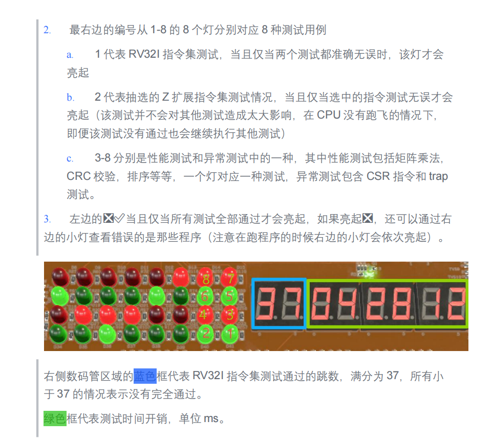

# jyd_irom_v2 测试内容整理

本文根据 `vivado/tests/build/jyd_irom_v2.dump` 反汇编结果，并结合板卡照片中的 LED/数码管说明，整理 `jyd_irom_v2` 镜像包含的测试内容、显示含义和通过判定方式。



## 1. 程序主流程

反汇编入口位于 dump 偏移 `0x00000000`：

```text
0x0000: 设置 sp
0x0008: jal 0xf78   ; RV32I 基础指令汇编自检
0x000c: jal 0x1cf8  ; RV32M 扩展汇编自检
0x0010: jal 0xe4    ; 结果判定、计时、显示和后续测试
0x0014: 自旋
```

主控函数 `0x00e4` 的核心行为：

- 读取 `0x8010_0000`，检查 RV32I 通过计数是否为 `37`。
- 读取 `0x8010_0030`，检查 RV32M 通过计数是否为 `8`。
- 将通过计数写到数码管显示区。
- 启动 `COUNTER`，执行 CSR/trap 测试和矩阵乘法性能/正确性测试，再读取计时值。
- 按测试结果或阶段状态更新 LED 位图，最后根据总通过标志显示整体通过或失败图案。

## 2. 六类测试内容

| 序号 | 测试内容 | dump 中的主要位置 | 通过条件/判定 |
| --- | --- | --- | --- |
| 1 | RV32I 基础指令集自检 | `0xf78` 调用 `0x1028` 到 `0x1c94` 的 37 个子测试 | 通过计数 `0x8010_0000 == 37` |
| 2 | RV32M 乘除法扩展自检 | `0x1cf8` 调用 `0x1d2c` 到 `0x20e4` 的 8 个子测试 | 通过计数 `0x8010_0030 == 8` |
| 3 | Zicsr/CSR 读写自检 | `0x02ec` 中的 `csrrw/csrrs/csrrc` 和立即数 CSR 指令 | CSR 返回值和最终 `mscratch` 值全部匹配 |
| 4 | trap/异常返回自检 | `0x02ec` 触发 `ecall`，异常入口在 `0x2170`，返回用 `mret` | `mcause/mstatus/mepc` 保存恢复正确，`mepc` 按 `+4` 返回 |
| 5 | 80x80 矩阵乘法性能与正确性测试 | `0xeac` 初始化矩阵，`0x980` 和 `0xabc` 两种实现，`0xcf8` 比较结果 | 连续 10 轮计算，两种实现输出完全一致 |
| 6 | 外设显示、计时和总结果显示 | `0x6f8/0x774/0x7d8/0x8e8/0x91c/0x950` | 数码管、LED、COUNTER MMIO 访问按预期执行 |

### 2.1 小灯编号与测试内容编号

图片上的 1-8 编号位置为：右下角是 1、左下角是 2，向上依次是右列 3/5/7、左列 4/6/8。结合 dump 中写入 LED 的 mask，可得到如下对应关系：

| 图片小灯编号 | 物理位置 | LED mask | dump 触发位置 | dump 中实际绑定的测试/状态 | 对应上表编号 |
| --- | --- | --- | --- | --- | --- |
| 1 | 右下 | `0x0000_0001` | `0x0138` | RV32I 通过计数为 37，且 RV32M 通过计数为 8 | 1、2 |
| 2 | 左下 | `0x0000_0002` | `0x018c` | 固定置位；dump 中未发现它绑定独立 Z 扩展测试返回值 | 6 |
| 3 | 右下往上一格 | `0x0000_0100` | `0x0178` | 80x80 矩阵乘法性能/正确性测试通过 | 5 |
| 4 | 左下往上一格 | `0x0000_0200` | `0x01a0` | 固定置位；dump 中未发现独立测试返回值 | 6 |
| 5 | 右上往下一格 | `0x0001_0000` | `0x01b4` | 固定置位；dump 中未发现独立测试返回值 | 6 |
| 6 | 左上往下一格 | `0x0002_0000` | `0x015c` | Zicsr/CSR 读写和 trap/异常返回测试通过 | 3、4 |
| 7 | 右上 | `0x0100_0000` | `0x01c8` | 固定置位；dump 中未发现独立测试返回值 | 6 |
| 8 | 左上 | `0x0200_0000` | `0x01dc` | 固定置位；dump 中未发现独立测试返回值 | 6 |

按测试内容编号反查小灯：

| 测试内容编号 | 测试内容 | 对应小灯编号 |
| --- | --- | --- |
| 1 | RV32I 基础指令集自检 | 1 |
| 2 | RV32M 乘除法扩展自检 | 1 |
| 3 | Zicsr/CSR 读写自检 | 6 |
| 4 | trap/异常返回自检 | 6 |
| 5 | 80x80 矩阵乘法性能与正确性测试 | 3 |
| 6 | 外设显示、计时和总结果显示 | 2、4、5、7、8 |

核对结论：

- 图片编号和 LED mask 的位置对应是自洽的：`0x1/0x2` 对应底行 1/2，`0x100/0x200` 对应上一行 3/4，`0x10000/0x20000` 对应 5/6，`0x01000000/0x02000000` 对应顶行 7/8。反汇编中的 `lui a1,0x1000` 和 `lui a1,0x2000` 分别生成 `0x01000000` 和 `0x02000000`，因为 LUI 立即数需要左移 12 位。
- 图片文字称小灯 2 表示抽选的 Z 扩展测试；但在 `jyd_irom_v2.dump` 中，小灯 2 对应的 `0x0000_0002` 是无条件置位，没有看到独立 Z 扩展测试返回值。Zicsr/CSR 与 trap 测试实际由小灯 6 表示。
- 小灯 1 在 dump 中是 RV32I 与 RV32M 的联合通过标志，不是只检查 RV32I；小灯 6 是 CSR 与 trap 的联合通过标志。小灯 2、4、5、7、8 更接近阶段/显示状态位，不能单独视为某个算法测试的通过返回值。

说明：图片文字提到右侧编号 `3-8` 对应性能和异常测试中的若干项目。但从 `jyd_irom_v2.dump` 的主流程看，真正由函数返回值动态判定的是 CSR/trap 测试和矩阵乘法测试；其余若干 LED 位是在程序运行到对应阶段后直接置位，用作状态/占位显示，而不是独立算法函数的返回结果。

## 3. RV32I 基础指令集自检

入口 `0xf78` 连续调用 37 个汇编子测试。每个子测试内部直接构造寄存器值、执行待测指令，再用 `bne/beq` 等分支比较实际结果与期望值：

- 成功时递增 `0x8010_0000` 的通过计数。
- 失败时递增 `0x8010_0004` 的失败计数。

覆盖范围从指令形态看包括：

- 整数算术：`add/sub/addi` 及溢出回绕场景。
- 逻辑和移位：`and/or/xor`、`sll/srl/sra` 及立即数形式。
- 比较与分支：`slt/sltu`、`beq/bne/blt/bge/bltu/bgeu`。
- 跳转：`jal/jalr`，并检查返回地址。
- 访存：`lw/sw` 及不同地址/数据依赖场景。
- 立即数与 PC 相对类指令：`lui/auipc` 等。

主流程要求 RV32I 通过计数等于 `37`。数码管左侧蓝框区域显示的就是该通过计数；图片中说明满分为 `37`，小于 `37` 表示 RV32I 自检没有完全通过。

## 4. RV32M 扩展自检

入口 `0x1cf8` 调用 8 个 M 扩展子测试：

| 子测试入口 | 指令 | 主要覆盖场景 |
| --- | --- | --- |
| `0x1d2c` | `mul` | 0 乘法、负数乘法、低 32 位截断 |
| `0x1db4` | `mulh` | 有符号高 32 位、负数和 `0x8000_0000` 边界 |
| `0x1e3c` | `mulhsu` | 有符号乘无符号的高 32 位 |
| `0x1ec8` | `mulhu` | 无符号高 32 位 |
| `0x1f54` | `div` | 有符号除法、除零、`INT_MIN / -1` 溢出语义 |
| `0x1fd8` | `divu` | 无符号除法、除零 |
| `0x2060` | `rem` | 有符号余数、除零、溢出语义 |
| `0x20e4` | `remu` | 无符号余数、除零 |

通过计数写入 `0x8010_0030`，失败计数写入 `0x8010_0034`。主流程要求通过计数等于 `8`。

## 5. CSR 与 trap 测试

CSR/trap 主测试入口为 `0x02ec`，异常入口设置函数为 `0x020c`，异常处理入口为 `0x2170`。

测试内容包括：

- 设置 `mtvec = 0x8000_2170`，然后读回确认。
- 保存原 `mscratch`，依次测试 `csrrw`、`csrrs`、`csrrc`。
- 测试立即数形式 `csrrwi`、`csrrsi`、`csrrci`。
- 恢复 `mscratch` 并确认恢复值正确。
- 触发两次 `ecall`，异常处理程序保存通用寄存器和 `mcause/mstatus/mepc`。
- 异常处理逻辑将 `mepc += 4`，最后执行 `mret` 回到 `ecall` 后一条指令。
- 返回后检查异常次数、入口保存值、返回 PC 和寄存器值。

只要任一 CSR 返回值、异常次数、`mepc` 返回地址或寄存器保存恢复结果不符合预期，该测试返回 `0`，主流程会清除总通过标志。

## 6. 矩阵乘法性能与正确性测试

性能测试入口为 `0xeac`。该测试使用 3 个 80x80 的 32 位矩阵区域：

- 矩阵 A：`0x8010_003c`
- 矩阵 B：`0x8010_643c`
- 结果/参考区域：`0x8010_c83c`、`0x8011_2c3c`

测试流程：

1. 用 `(i * j + seed) % 100` 初始化两个输入矩阵。
2. 调用 `0x980` 执行直接三重循环矩阵乘法。
3. 调用 `0xabc` 执行带局部转置/访问优化的矩阵乘法。
4. 调用 `0xcf8` 逐元素比较两个输出矩阵。
5. 上述流程循环 10 次，任一轮比较失败则返回 `0`。

主流程在该测试前向 `COUNTER` 地址 `0x8020_0050` 写入 `0x8000_0000` 开始计数，测试后读取计时值并写入数码管。图片中绿色框区域显示的就是测试耗时，单位为 ms。

## 7. LED 与数码管显示关系

### 7.1 数码管

相关函数：

- `0x650`：把十进制数转换成按 4 bit 分组的 BCD/数码管显示格式。
- `0x6f8`：读取 RV32I 通过计数和 RV32M 通过计数，写入 `SEG` 地址 `0x8020_0020`。
- `0x774`：把测试耗时合并到数码管低位显示。

图片中的含义：

- 蓝色框：RV32I 通过跳数，满分 `37`。
- 绿色框：测试时间开销，单位 ms。

### 7.2 LED

相关函数：

- `0x810`：将通过的测试位 OR 到 `0x8010_0038`，再写到 `LED` 地址 `0x8020_0040`。
- `0x7d8`：直接写 LED MMIO。
- `0x860`：总通过图案，OR 入 `0x04887020`。
- `0x8a4`：失败图案，OR 入 `0x90606090`。

右侧小灯和测试内容编号的详细对应关系见第 2.1 节。

左侧的整体结果符号按图片说明理解：

- `√` 亮起：所有被主流程纳入总通过标志的测试均通过。
- `×` 亮起：至少一个关键测试失败。此时仍可通过右侧小灯判断已通过或失败的大致阶段。

从 dump 看，影响总通过标志的关键项包括：

- RV32I 通过计数是否为 `37`。
- RV32M 通过计数是否为 `8`。
- CSR/trap 测试返回值。
- 矩阵乘法性能/正确性测试返回值。

## 8. 结论

`jyd_irom_v2` 不是单一算法镜像，而是一个板级综合验证镜像：先运行 RV32I/RV32M 汇编自检，再运行 CSR/trap 和矩阵乘法性能测试，并通过 LED、数码管和计时器给出可观察结果。结合图片观察时，应优先看蓝框 RV32I 通过计数是否达到 `37`，再看右侧关键灯位和左侧总结果符号；绿色框可用于比较性能耗时。
