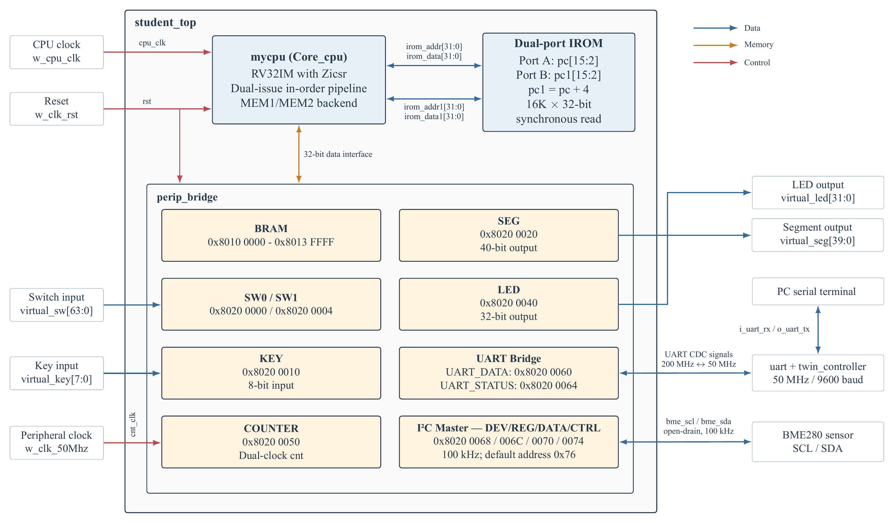
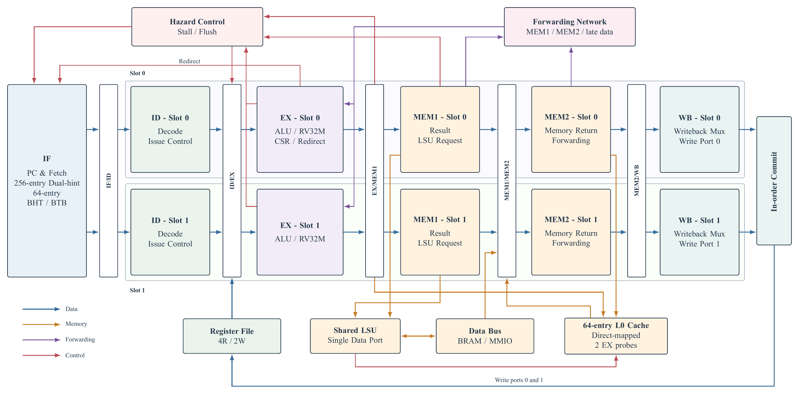
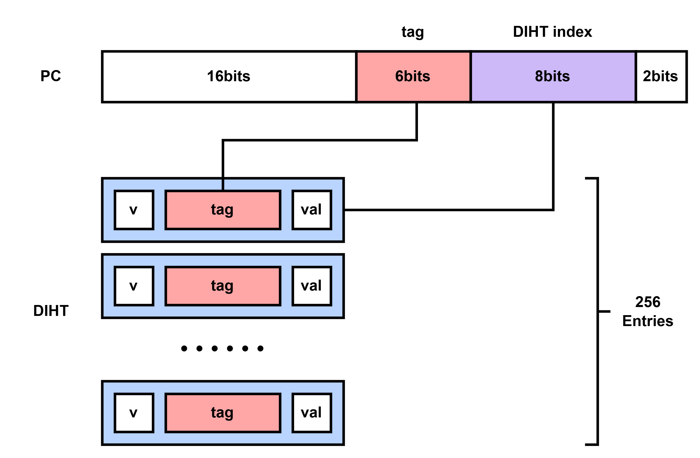
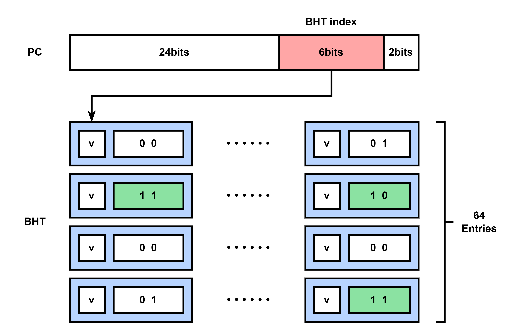
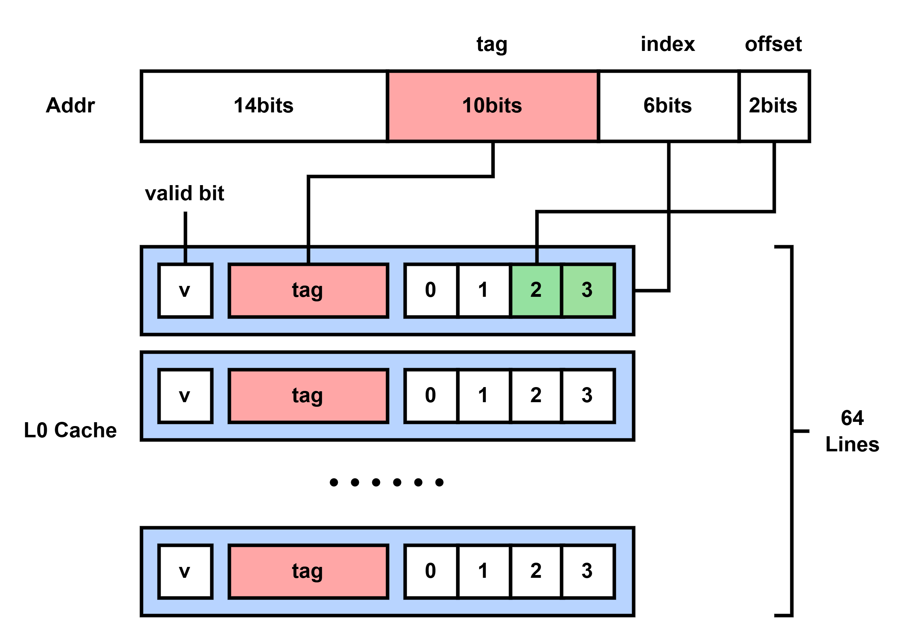
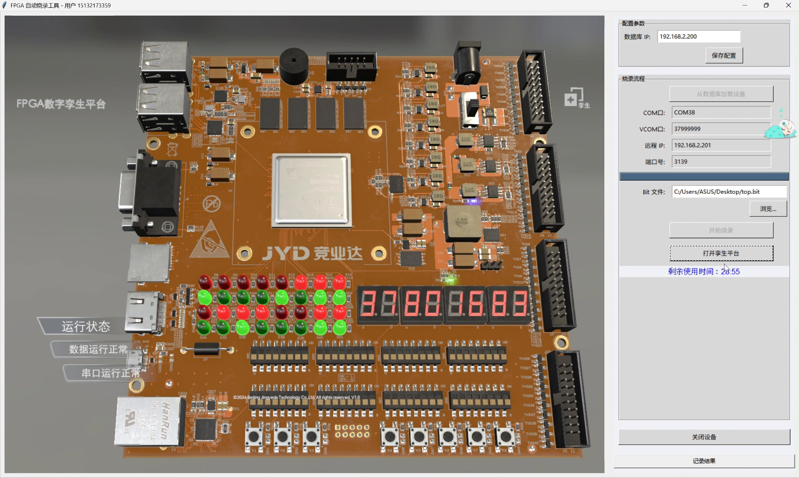

# 项目概述

## 项目背景

本项目是全国大学生集成电路创新创业大赛“竞业达”企业命题的参赛设计。赛题要求在 FPGA 数字孪生平台上实现一款 RISC-V 处理器，正确执行 RV32I 指令和指定测试程序，并通过 LED、数码管和计时器显示运行结果。

处理器采用 32 位小端 RISC-V 架构，运行无操作系统的裸机程序。除了比赛要求的 RV32I 基础指令，当前 RTL 还支持 RV32M、项目测试所需的 Zicsr 指令和机器模式异常返回。设计时主要考虑流水线吞吐率、同步存储器时序与 FPGA 工作频率。

## 作品核心内容快速预览

本作品在固定 CPU 顶层接口和 SoC 地址映射下，实现了一款面向 FPGA 的 32 位 RISC-V 处理器。核心设计采用双槽顺序发射与顺序提交，在适配同步 IROM、BRAM 时序的同时，通过动态分支预测、多级前递、精确冒险控制、RV32M 多周期执行和 L0 load cache 提升流水线利用率。作品已完成 CPU-only 仿真、开源指令测试交叉验证、竞赛综合程序验证和 FPGA 板级验证。

- **指令与异常支持：**  
  核心内容：37 条 RV32I 基础指令、RV32M 全部 8 条指令，以及项目所需的 Zicsr、`ecall` 和 `mret`。  
  正文索引：RV32I 指令集支持情况（第 \pageref{sec-rv32i-support} 页）、RV32M 多周期运算（第 \pageref{sec-rv32m-design} 页）、Zicsr 与机器模式异常返回（第 \pageref{sec-zicsr-trap} 页）。
- **流水线组织：**  
  核心内容：双槽顺序发射、顺序提交，实际流水边界为 `IF/ID -> ID/EX -> EX/MEM1 -> MEM1/MEM2 -> MEM2/WB`。  
  正文索引：CPU 核心微架构（第 \pageref{sec-core-microarchitecture} 页）、双槽顺序发射与流水化访存（第 \pageref{sec-dual-issue-memory} 页）。
- **性能优化：**  
  核心内容：64 项 2 位饱和计数 BHT、BTFNT 冷启动预测、256 项双发射提示表、多级前递和 64 项直接映射 L0 load cache。  
  正文索引：动态分支预测（第 \pageref{sec-branch-prediction} 页）、L0 load cache（第 \pageref{sec-l0-cache-design} 页）、面向时序收敛的性能优化（第 \pageref{sec-timing-optimization} 页）。
- **存储与接口：**  
  核心内容：单数据端口，支持 BRAM 与 MMIO、byte/half/word 小端访问；L0 对 BRAM load 缓存完整 32 位字，store 写穿并失效缓存行。  
  正文索引：共享访存端口与 L0 cache（第 \pageref{sec-mem-l0-microarchitecture} 页）、load_l0_cache（第 \pageref{sec-load-l0-cache-module} 页）、perip_bridge（第 \pageref{sec-perip-bridge} 页）。
- **功能验证：**  
  核心内容：项目定向测试全部通过；`riscv-tests` 的 37 项 `rv32ui-p` 与 8 项 `rv32um-p` 白名单测试共 45 项全部通过。  
  正文索引：测试体系（第 \pageref{sec-test-system} 页）、功能验证（第 \pageref{sec-functional-verification} 页）、功能测试汇总（第 \pageref{sec-functional-summary} 页）。
- **性能与板级结果：**  
  核心内容：`perf_micro` 的 CPI 为 0.956；竞赛 `irom-v2` 综合程序 CPI 为 1.062、L0 命中率为 62.995%；240 MHz FPGA 板级计时为 1,683 ms，与仿真结果一致。  
  正文索引：性能评估（第 \pageref{sec-performance-evaluation} 页）、竞赛 `irom-v2` 综合程序性能（第 \pageref{sec-irom-v2-performance} 页）、FPGA 板级验证（第 \pageref{sec-fpga-validation} 页）。

## 设计目标

设计目标如下：

1. 正确实现比赛要求的 37 条 RV32I 基础整数指令；
2. 支持 RV32M 全部 8 条乘除法指令，并处理除零和有符号除法溢出；
3. 支持最小 Zicsr/M-mode trap 子集，满足裸机异常入口和返回需求；
4. 在保持顺序提交的前提下，每拍最多发射和提交两条指令；
5. 通过前递、冒险检测、分支预测和小容量缓存降低流水线停顿；
6. 保持 CPU 顶层接口和 SoC 地址映射不变，使仿真模型与板级工程使用相同的接口时序。

## 设计平台

- FPGA 平台：竞业达 FPGA 数字孪生平台；
- 目标器件：Xilinx Kintex-7 XC7K325T-FFG900-2；
- 开发工具：AMD Vivado 2025.2.1；
- 硬件描述语言：SystemVerilog；
- RTL 仿真工具：Verilator 5.020、Vivado XSim 和 Icarus Verilog；
- 软件工具链：RISC-V GNU Toolchain GCC 13.2.0，目标为 `rv32im_zicsr/ilp32`；
- 板级时钟：200 MHz 差分输入，PLL 生成 240 MHz CPU 时钟和 50 MHz 外设时钟。

# RISC-V CPU 架构设计

## RV32I 指令集支持情况 {#sec-rv32i-support}

设计已覆盖比赛基础考核涉及的 37 条 RV32I 指令。`fence` 和 `ebreak` 不属于这 37 条指令，`ecall` 则由机器模式 trap 通路处理。

| 类别 | 指令 | 数量 |
| --- | --- | ---: |
| 高位立即数 | `lui`、`auipc` | 2 |
| 跳转 | `jal`、`jalr` | 2 |
| 条件分支 | `beq`、`bne`、`blt`、`bge`、`bltu`、`bgeu` | 6 |
| Load | `lb`、`lh`、`lw`、`lbu`、`lhu` | 5 |
| Store | `sb`、`sh`、`sw` | 3 |
| 立即数运算 | `addi`、`slti`、`sltiu`、`xori`、`ori`、`andi`、`slli`、`srli`、`srai` | 9 |
| 寄存器运算 | `add`、`sub`、`sll`、`slt`、`sltu`、`xor`、`srl`、`sra`、`or`、`and` | 10 |
| 合计 |  | **37** |

Table: RV32I 基础指令支持范围

算术结果按 32 位回绕，移位量取低 5 位；`x0` 恒为零，`jalr` 目标地址的最低位清零。设计只保证自然对齐访存，暂不处理非法指令、未对齐访问和总线访问故障异常。

## SoC 层次与接口

系统以 `student_top` 为处理器子系统边界，由 CPU 核 `Core_cpu`、两路指令 ROM 和外设桥 `perip_bridge` 组成。CPU 时钟驱动处理器核和桥接逻辑，50 MHz 外设时钟单独送入 COUNTER。复位信号进入 CPU 核，并通过各级 valid 和副作用使能保证复位期间不会产生寄存器写、存储器写或 CSR 写。

{ width=100% }

CPU 核对外提供两组独立的 32 位只读取指接口。第一路读取当前 PC 对应的指令，第二路读取 `PC+4` 对应的相邻指令；`student_top` 分别用 `pc[13:2]` 和 `(pc+4)[13:2]` 访问两路同步 IROM。高位 PC 在 IROM 寻址时被有意忽略，两路返回数据共同构成最多包含两条连续指令的取指包。

数据侧只有一组 32 位统一接口，包含地址、写数据、读数据、写使能和访问宽度控制。`perip_bridge` 依据地址将请求送往同步 BRAM 或 MMIO 外设；BRAM 读数据按流水时序返回，MMIO 读取使用独立的数据返回路径。当前地址映射如下。

| 访问目标 | 地址范围或地址 | 接口属性 |
| --- | --- | --- |
| BRAM | `0x8010_0000`--`0x8013_FFFF` | 256 KiB 数据存储器，支持 byte、half 和 word 访问 |
| SW0 | `0x8020_0000` | 低 32 位虚拟开关，只读 |
| SW1 | `0x8020_0004` | 高 32 位虚拟开关，只读 |
| KEY | `0x8020_0010` | 8 位虚拟按键，只读 |
| SEG | `0x8020_0020` | 40 位数码管输出寄存器 |
| LED | `0x8020_0040` | 32 位 LED 输出寄存器 |
| COUNTER | `0x8020_0050` | 50 MHz 跨时钟域性能计数器 |

Table: CPU 子系统地址映射

## CPU 核心微架构 {#sec-core-microarchitecture}

CPU 采用双槽顺序发射、顺序提交结构。源码仍按 IF、ID、EX、MEM 和 WB 五类功能模块组织，但为适配同步 BRAM，访存后端被拆分为 MEM1 和 MEM2，因此实际流水边界为 `IF/ID -> ID/EX -> EX/MEM1 -> MEM1/MEM2 -> MEM2/WB`。图中的上、下两条主数据通路分别对应槽 0 和槽 1：槽 0 保存包内较老指令，槽 1 保存较年轻指令。

{ width=100% }

蓝色主通路表示取指、级间数据传递和寄存器写回，橙色通路表示共享 LSU、数据总线与 L0 cache 的访存路径，紫色通路表示 MEM1、MEM2、WB 到 EX 的前递网络，红色通路表示 stall、flush、busy 和重定向等控制反馈。数据与控制信号都随 valid 一起经过级间寄存器；复位、冲刷或气泡会清除有效性，并屏蔽错误路径上的所有体系结构副作用。

### 双路取指与分支预测（IF）

PC 是复位值为 `0x8000_0000` 的 32 位寄存器。IF 并行形成 `PC+4`、`PC+8` 和预测目标，并在 EX 重定向、预测跳转与顺序地址之间选择下一 PC。双发射时顺序前进 8 字节，单发射时前进 4 字节。

为避免把完整的配对判断放入 PC 反馈关键路径，前端维护 256 项直接映射双发射提示表。同步 IROM 返回两条指令后，硬件判断该取指位置是否适合形成双槽包并训练表项；冷启动、tag 未命中或预测跳转时先按单发射处理。条件分支使用 64 项 2 位饱和计数 BHT，未训练项采用 BTFNT；`jal` 在 IF 直接预测目标，`jalr`、异常入口和 `mret` 在 EX 解析。

### 译码、寄存器读取与发射控制（ID）

两个 ID 槽分别完成主控制译码、ALU/CSR 控制译码、立即数生成和寄存器索引提取。共享寄存器组包含 32 个 32 位通用寄存器，提供 4 个读端口和 2 个写端口，可同时为两个槽读取各自的 `rs1`、`rs2`，并在同一拍接收两路写回。对 `x0` 的写入被屏蔽，读取 `x0` 始终得到 0；WB 到 ID 的同周期旁路用于消除寄存器组读写同拍造成的数据陈旧。

槽 1 只有在包内不存在 RAW 相关且资源允许时才有效。WAW 不阻止双发射；两槽写入同一 `rd` 时，较年轻的槽 1 结果覆盖槽 0。控制流、CSR、双访存和双 RV32M 等不能安全并行的组合退化为单发射，因此控制流重定向和 CSR 状态更新集中在较老的槽 0。该限制使两槽无需乱序调度或重排序缓冲区，仍可按程序顺序向后推进。

### 整数执行、多周期运算与重定向（EX）

两个 EX 槽均包含 RV32I ALU 和 RV32M 运算通路。ALU 使用 22 位独热控制码，低 14 位选择 RV32I 的算术、逻辑、移位和比较操作，高 8 位选择 RV32M 操作。Load/store 地址由独立的 `rs1+imm` 加法通路形成，以缩短通用 ALU 和访存地址计算的组合路径；分支比较也单独产生结果。

RV32M 单元启动时锁存操作数与类型。普通 `mul` 等待一个周期，高位乘法等待两个周期，普通除法和余数进行 32 次迭代；任一槽 busy 时，前端与 ID/EX 保持，避免尚未完成的多周期指令被覆盖。完成结果与普通 ALU 结果一样进入后端，可被后续指令前递。

槽 0 还包含 CSR 文件与统一重定向逻辑。CSR 文件实现 `mstatus`、`mtvec`、`mscratch`、`mepc` 和 `mcause`；`ecall` 保存异常 PC 并写入 `mcause=11` 后跳转到 `mtvec`，`mret` 恢复相关状态并跳转到 `mepc`。EX 将分支实际方向和目标与预测元数据比较，只有不一致时才把正确 PC 反馈到 IF，并冲刷 IF/ID 与 ID/EX。

### 共享访存端口与 L0 cache（MEM1/MEM2） {#sec-mem-l0-microarchitecture}

CPU 数据侧只有一个端口，因此同一发射包最多包含一条 load/store。MEM1 从两个槽中选择有效访存请求，通过共享 LSU 输出地址、写数据和访问宽度；LSU 按小端字节序生成 `sb`、`sh`、`sw` 所需的写数据与 byte mask。MEM2 将同步 BRAM 返回的完整 32 位原始字与相应流水元数据对齐，byte/half lane 选择及符号或零扩展留到写回路径完成。

64 项直接映射 L0 load cache 只保存 BRAM 的完整 32 位数据字，不缓存 MMIO。Load 在 EX 提前探测缓存；命中时，数据可在下一拍由 MEM1 送入前递网络，使紧随其后的相关指令更早取得操作数。未命中时，冒险控制等待 BRAM 数据沿 MEM2 后端返回。Store 对 BRAM 写穿，并使同一字地址对应的 L0 cache 行失效，因而不需要维护脏数据。

### 冒险控制与前递网络

冒险单元同时检查两个消费者槽对 ID/EX 和 EX/MEM1 中两槽 load 的依赖，并结合 L0 命中状态产生 stall、bubble 与 flush。普通 ALU 相关不必停顿，而由两个 EX 槽各自的前递选择器解决。候选值来自 MEM1、MEM2 和 WB，阶段优先级为 MEM1 高于 MEM2、高于 WB；同一阶段若存在多个有效生产者，则较年轻的槽 1 优先，从而选择程序顺序上最新的值。

控制流误预测的重定向优先于普通前端推进，并使错误路径指令失效；RV32M busy 则保持前端和 ID/EX。valid、stall、flush 与 busy 共同构成统一的流水控制，使停顿时不丢失在途指令、冲刷时不保留错误副作用。

### 写回选择与顺序提交（WB）

两个 WB 槽分别通过写回多路器选择 `PC+4`、ALU/RV32M 结果、load 扩展结果、U 型立即数或 CSR 旧值，再写入寄存器组的两个写端口。若两槽同拍有效，槽 0 先于槽 1 按程序顺序提交。图中的 In-order Commit 表示写回顺序约束，并不额外增加流水级。

## 主要数据通路选择

| 指令类型 | ALU 输入 A | ALU 输入 B | 运算或地址路径 | 下一 PC | 写回数据 |
| --- | --- | --- | --- | --- | --- |
| R 型 | `rs1` | `rs2` | ALU | `pc+4/pc+8` | ALU 结果 |
| I 型算术 | `rs1` | I 型立即数 | ALU | `pc+4/pc+8` | ALU 结果 |
| Load | `rs1` | I 型立即数 | LSU 地址加法器 | `pc+4/pc+8` | Load 扩展结果 |
| Store | `rs1` | S 型立即数 | LSU 地址加法器 | `pc+4/pc+8` | 无 |
| Branch | `rs1` | `rs2` | 分支比较器 | 预测地址或 EX 重定向 | 无 |
| `jal` | PC | J 型立即数 | 跳转目标加法 | 预测目标 | `pc+4` |
| `jalr` | `rs1` | I 型立即数 | ALU 加法并清除 bit 0 | EX 重定向 | `pc+4` |
| `lui` | 0 | U 型立即数 | 立即数直通 | `pc+4/pc+8` | U 型立即数 |
| `auipc` | PC | U 型立即数 | ALU 加法 | `pc+4/pc+8` | ALU 结果 |

Table: RV32I 各类指令的数据通路选择

写回多路器根据 `MemToReg` 选择数据：`000` 对应 `pc+4`，`001` 对应 ALU/RV32M 结果，`010` 对应 load 数据，`011` 对应 U 型立即数，`100` 对应 CSR 旧值。两个槽共用这套编码。

## 控制器与流水控制

### 控制信号表

| 指令类型 | `NpcOp` | `RegWrite` | `MemToReg` | `MemRead` | `MemWrite` | `ALUSrcA` | `ALUSrcB` |
| --- | --- | ---: | --- | ---: | ---: | ---: | ---: |
| R 型/RV32M | `00` | 1 | `001` | 0 | 0 | 0 | 0 |
| I 型算术 | `00` | 1 | `001` | 0 | 0 | 0 | 1 |
| Load | `00` | 1 | `010` | 1 | 0 | 0 | 1 |
| Store | `00` | 0 | `000` | 0 | 1 | 0 | 1 |
| Branch | `01` | 0 | `000` | 0 | 0 | 0 | 0 |
| `jal` | `11` | 1 | `000` | 0 | 0 | 0 | 1 |
| `jalr` | `10` | 1 | `000` | 0 | 0 | 0 | 1 |
| `lui` | `00` | 1 | `011` | 0 | 0 | 0 | 1 |
| `auipc` | `00` | 1 | `001` | 0 | 0 | 1 | 1 |
| Zicsr | `00` | 1 | `100` | 0 | 0 | 0 | 1 |
| `ecall/mret` | `10` | 0 | `000` | 0 | 0 | 0 | 1 |

Table: 各类指令的主要控制信号

`NpcOp=00/01/10/11` 依次表示顺序执行、条件分支、绝对目标类重定向和 `jal`。`OffsetOrigin` 区分普通立即数、`jalr` 的 ALU 结果与 CSR trap 目标。控制信号和 valid 随级间寄存器向后传递，不跨级直接驱动后端副作用。

### 分层译码与控制传递

控制器采用分层译码。`main_ctrl` 生成寄存器写、访存、写回和下一 PC 控制；`imm_gen` 生成 I/S/B/U/J 五类立即数；`alu_ctrl` 根据 `opcode`、`funct3` 和 `funct7` 产生 22 位独热运算码；`csr_ctrl_decode` 识别六种 Zicsr 指令以及 `ecall`、`mret`。`mycpu_decoder` 将这些子模块封装为单槽译码器，两个 ID 槽各实例化一套。

双发射判定会检查 slot0 到 slot1 的 RAW 依赖，以及双访存和双 RV32M 冲突；WAW 不会阻止双发射，同一拍写入同一 `rd` 时，第二槽结果覆盖第一槽。控制流、CSR、双访存及双 RV32M 组合均按单发射执行。EX 级把实际分支结果与预测元数据进行比较；方向或目标不一致时重定向 PC，并冲刷 IF/ID 和 ID/EX，预测正确时则让流水线继续执行。

执行 `ecall` 时，处理器保存异常 PC，写入 `mcause=11`，随后跳转到 `mtvec`；执行 `mret` 时，处理器恢复 `mstatus.MIE/MPIE` 并跳转到 `mepc`。

译码结果不会跨级直接驱动后端副作用，而是与 PC、寄存器索引、预测元数据和 valid 一起逐级寄存。ID 发射控制先关闭不满足配对条件的槽 1；冒险控制再根据在途指令决定保持或插入气泡；EX 重定向则使错误路径失效。当前异常体系只覆盖项目测试所需的机器模式最小子集，尚未实现非法指令、未对齐访问、总线故障、中断、U/S 模式和完整 CSR 权限检查。

# RTL 关键模块设计

## 模块选取原则

本章不再逐一罗列工程中的全部 RTL 文件，而只选取直接体现处理器总体组织、双槽流水控制、数据相关处理和存储优化的 10 个关键模块。级间寄存器、小型译码子模块、通用复用器以及显示、UART 等外围模块不单独展开，其作用已在架构章节和附录代码清单中说明。

## CPU 核心与流水级

### mycpu

功能描述：CPU 核心顶层，连接双路取指、双槽流水数据通路、寄存器堆、冒险与前递网络、RV32M、CSR、分支重定向、共享 LSU 和 L0 load cache。模块负责维持槽 0 先于槽 1 的顺序提交，并通过 valid、stall、flush 和 kill 屏蔽气泡与错误路径的副作用。

接口描述：

| 端口名 | 类型 | 描述 |
| --- | --- | --- |
| cpu_clk, cpu_rst | input | CPU 主时钟与高有效复位 |
| irom_addr, irom_addr1 | output | 两路 32 位取指地址 |
| irom_data, irom_data1 | input | 两路 32 位 IROM 指令数据 |
| perip_addr | output | 32 位 BRAM/MMIO 统一地址 |
| perip_wen, perip_mask | output | 写使能与 2 位访问宽度 |
| perip_wdata | output | 32 位写数据 |
| perip_rdata | input | 32 位读返回 |

Table: mycpu 接口描述

### mycpu_if_stage

功能描述：IF 级维护 PC，输出 PC 和 PC+4 两路取指地址，并在顺序地址、预测目标和 EX 重定向目标之间选择下一 PC。内部双发射提示表把复杂的包内配对判断移出 PC 反馈关键路径；冷启动或 tag 未命中时保守单发射，Stall 有效时保持当前 PC。

接口描述：

| 端口名 | 类型 | 描述 |
| --- | --- | --- |
| irom_data, irom_data1 | input | 两路 32 位返回指令 |
| IF_npc_redirect | input | 32 位 EX 纠错目标 |
| clk, rst | input | 时钟与高有效复位 |
| Stall, BranchRedirect | input | 前端冻结与重定向有效 |
| BP_update_en, BP_update_taken | input | 预测器更新使能与实际方向 |
| BP_update_pc | input | 32 位已解析分支 PC |
| irom_addr, irom_addr1 | output | 两路 32 位取指地址 |
| IF_pc | output | 32 位当前 PC |
| IF_instr, IF_instr1 | output | 取指包的两条指令 |
| IF_issue_dual | output | 双发射提示 |
| IF_pred_taken, IF_pred_target | output | 预测方向与 32 位目标 |

Table: mycpu_if_stage 接口描述

### mycpu_id_stage

功能描述：ID 级单槽译码外壳，内部通过统一译码器完成寄存器字段抽取、主控制译码、立即数生成、ALU 独热译码以及 CSR/系统指令译码。核心对两个指令槽各实例化一份，并在顶层完成包内相关和资源冲突检查。

接口描述：

| 端口名 | 类型 | 描述 |
| --- | --- | --- |
| ID_instr | input | 32 位 ID 指令 |
| ID_imm | output | 32 位扩展立即数 |
| ID_RegWrite | output | 寄存器写使能 |
| ID_MemWrite, ID_MemRead | output | store/load 控制 |
| ID_ALUSrcA, ID_ALUSrcB | output | ALU 输入来源 |
| ID_MemToReg | output | 3 位写回来源 |
| ID_NpcOp, ID_OffsetOrigin | output | 两组 2 位控制流控制 |
| ID_ALUControl | output | 22 位运算独热码 |
| ID_csr_idx, ID_csr_zimm | output | CSR 地址与立即数 |
| ID_CSRControll | output | 6 位 CSR/系统控制 |
| ID_rs1, ID_rs2, ID_rd | output | 三组 5 位寄存器索引 |

Table: mycpu_id_stage 接口描述

### mycpu_ex_stage

功能描述：EX 级使用已选前递数据完成 RV32I 运算、load/store 地址生成、RV32M 多周期执行、CSR 读改写和控制流解析。RV32M 执行期间通过 EX_busy 保持前端与 ID/EX；EX_kill 用于禁止错误路径启动多周期运算、写 CSR 或产生重定向。

接口描述：

| 端口名 | 类型 | 描述 |
| --- | --- | --- |
| EX_pc, EX_imm | input | 32 位 PC 与立即数 |
| EX_rR1_data, EX_rR2_data | input | 两个 32 位原始操作数 |
| EX_ALUControl | input | 22 位运算控制 |
| EX_NpcOp, EX_OffsetOrigin | input | 控制流与目标来源控制 |
| EX_csr_idx, EX_csr_zimm | input | CSR 地址与 5 位立即数 |
| EX_CSRControll | input | 6 位 CSR/系统控制 |
| ForwardAData, ForwardBData | input | 两个 32 位已选前递值 |
| EX_ALUSrcA, EX_ALUSrcB | input | ALU 输入来源选择 |
| EX_pred_taken, EX_pred_target | input | 预测方向与目标 |
| EX_stall, EX_kill | input | 多周期保持与失效屏蔽 |
| IF_npc_redirect_raw | output | 32 位实际下一 PC |
| EX_alu_result | output | 32 位 ALU/RV32M 结果 |
| EX_mem_addr | output | 32 位访存地址 |
| EX_forward_B_out | output | 32 位前递后 rs2 |
| EX_csr_wb | output | 32 位 CSR 旧值 |
| BranchTaken, BranchMispredict | output | 实际转移与误预测标志 |
| EX_busy | output | RV32M 未完成标志 |

Table: mycpu_ex_stage 接口描述

## 执行与多周期运算

### alu

功能描述：EX 级 32 位 RV32I 计算单元，使用 ALUControl[13:0] 完成加减、逻辑、移位和有符号/无符号比较。加法、减法及比较共享加减法器；分支判断通过 isTrue 独立输出，避免在控制流路径上再次比较运算结果。

接口描述：

| 端口名 | 类型 | 描述 |
| --- | --- | --- |
| A, B | input | 两个 32 位操作数 |
| ALUControl | input | 22 位独热码，本模块使用低 14 位 |
| Result | output | 32 位运算结果 |
| isTrue | output | 分支条件布尔结果 |

Table: alu 接口描述

### rv32m_unit

功能描述：实现 `mul`、`mulh`、`mulhsu`、`mulhu`、`div`、`divu`、`rem` 和 `remu`。普通乘法等待 1 个周期，高位乘法等待 2 个周期，正常除法和余数运算执行 32 次迭代；除零及有符号溢出使用快速特殊结果路径。

接口描述：

| 端口名 | 类型 | 描述 |
| --- | --- | --- |
| clk, rst | input | 时钟与高有效同步复位 |
| start | input | 运算启动脉冲 |
| alu_control | input | 22 位独热码，使用高 8 位 |
| operand_a, operand_b | input | 两个 32 位操作数 |
| busy | output | 正在执行标志 |
| done | output | 结果完成脉冲 |
| result | output | 32 位结果 |

Table: rv32m_unit 接口描述

## 冒险、前递与存储优化

### forwarding_unit

功能描述：单槽 EX 操作数前递选择器，核心对两个消费者槽各实例化一份。模块集中比较 rs1/rs2 与 MEM1、MEM2、WB 两槽目的寄存器，并直接输出来源编码和最终数据。优先级为 MEM1 高于 MEM2、高于 WB；同一阶段内槽 1 优先于槽 0。

接口描述：

| 端口名 | 类型 | 描述 |
| --- | --- | --- |
| ID_EX_rs1, ID_EX_rs2 | input | 两个 5 位源寄存器 |
| ID_EX_data1, ID_EX_data2 | input | 两个 32 位原始值 |
| EX_MEM_rd0, EX_MEM_rd1 | input | MEM1 两槽目的寄存器 |
| EX_MEM_valid0, EX_MEM_valid1 | input | MEM1 两槽前递有效 |
| MEM2_rd0, MEM2_rd1 | input | MEM2 两槽目的寄存器 |
| MEM2_valid0, MEM2_valid1 | input | MEM2 两槽前递有效 |
| MEM_WB_rd0, MEM_WB_rd1 | input | WB 两槽目的寄存器 |
| MEM_WB_valid0, MEM_WB_valid1 | input | WB 两槽前递有效 |
| EX_MEM_data0/1, MEM2_data0/1 | input | MEM1、MEM2 两槽候选数据 |
| MEM_WB_data0, MEM_WB_data1 | input | WB 两槽候选数据 |
| ForwardA, ForwardB | output | 两组 3 位来源编码 |
| ForwardAData, ForwardBData | output | 两个 32 位最终操作数 |

Table: forwarding_unit 接口描述

### hazard_unit

功能描述：同时检查 IF/ID 两个消费者槽对 ID/EX 和 EX/MEM1 两个 load 生产者槽的依赖，并结合 LoadReady 判断 L0 命中数据能否及时前递。数据未就绪时冻结前端并向 ID/EX 注入气泡，误预测时冲刷 IF/ID 与 ID/EX。

接口描述：

| 端口名 | 类型 | 描述 |
| --- | --- | --- |
| IF_ID_rs1/rs2, IF_ID_rs1_1/rs2_1 | input | 两槽源寄存器索引 |
| IF_ID_uses_rs1/rs2 | input | 槽 0 源字段有效性 |
| IF_ID_uses_rs1_1/rs2_1 | input | 槽 1 源字段有效性 |
| IF_ID_valid_1 | input | 槽 1 有效 |
| ID_EX_rd, ID_EX_rd_1 | input | ID/EX 两槽 load 目的寄存器 |
| ID_EX_MemRead, ID_EX_MemRead_1 | input | ID/EX 两槽 load 标志 |
| ID_EX_LoadReady, ID_EX_LoadReady_1 | input | ID/EX 数据可前递 |
| EX_MEM_rd, EX_MEM_rd_1 | input | MEM1 两槽 load 目的寄存器 |
| EX_MEM_MemRead, EX_MEM_MemRead_1 | input | MEM1 两槽 load 标志 |
| EX_MEM_LoadReady, EX_MEM_LoadReady_1 | input | MEM1 数据已就绪 |
| BranchMispredict | input | 误预测状态 |
| Stall, Flush_IF_ID, Flush_ID_EX | output | 停顿与两级冲刷 |
| LoadUseEX, LoadUseMEM | output | 两类 load-use 统计 |

Table: hazard_unit 接口描述

### load_l0_cache {#sec-load-l0-cache-module}

功能描述：64 项直接映射的 BRAM load 结果缓存，保存完整 32 位字。lookup 端口服务 MEM1，probe 端口供 EX 提前判断 load-to-use；BRAM 返回数据通过 fill 端口写入。Store 仍写穿到 BRAM，并使同一字地址的缓存行失效；MMIO 不进入缓存。

接口描述：

| 端口名 | 类型 | 描述 |
| --- | --- | --- |
| clk, rst | input | 时钟与高有效复位 |
| lookup_addr | input | 32 位 MEM1 查询地址 |
| lookup_hit, lookup_data | output | 命中及 32 位查询数据 |
| probe_addr | input | 32 位 EX 探测地址 |
| probe_hit, probe_data | output | 命中及 32 位探测数据 |
| fill_en | input | 填充使能 |
| fill_addr, fill_data | input | 32 位填充地址与数据 |
| store_en, store_addr | input | store 失效使能与地址 |

Table: load_l0_cache 接口描述

## SoC 数据访问边界

### perip_bridge {#sec-perip-bridge}

功能描述：CPU 单一数据端口的地址译码与返回时序模块。它把 0x8010_0000--0x8013_FFFF 映射到 BRAM，并映射 SW0、SW1、KEY、SEG、LED 和 COUNTER；BRAM 按同步读时序返回，MMIO 使用独立的数据选择路径。

接口描述：

| 端口名 | 类型 | 描述 |
| --- | --- | --- |
| clk, cnt_clk | input | CPU 总线时钟与 50 MHz 计数时钟 |
| rst | input | 高有效复位 |
| perip_addr, perip_wdata | input | 32 位 CPU 地址与写数据 |
| perip_wen, perip_mask | input | 写使能与 2 位访问宽度 |
| perip_rdata | output | 32 位 BRAM/MMIO 返回 |
| virtual_sw_input | input | 64 位虚拟开关 |
| virtual_key_input | input | 8 位虚拟按键 |
| virtual_seg_output | output | 40 位数码管状态 |
| virtual_led_output | output | 32 位 LED 状态 |

Table: perip_bridge 接口描述

# CPU 特色功能设计

## 双槽顺序发射与流水化访存 {#sec-dual-issue-memory}

处理器每拍最多顺序发射两条指令。槽 1 只有在包内不存在 RAW 相关且访存、RV32M 和控制流资源允许时才有效；不能安全配对时自动退化为单发射。两个槽共享提交次序和数据总线仲裁，因此软件不需要专用指令，也不会改变程序的顺序语义。

槽 0 始终对应程序顺序中较老的指令，槽 1 对应较新的指令。配对成功时 PC 前进 8 字节，两条指令并行经过 ID、EX、MEM1、MEM2 和 WB；配对失败时只发射槽 0，槽 1 延后一拍重新执行。控制流、CSR、双访存和双 RV32M 组合均按单发射处理，避免两个槽同时竞争不可复制的资源。同拍写入同一目的寄存器时，较新的槽 1 结果最终生效，从而保持顺序执行语义。

IF 级使用 256 项直接映射双发射提示表，记录某个取指包能否安全双发射。tag 未命中、冷启动或发生预测跳转时先按单发射执行，待双路 IROM 返回后再完成指令类型、包内 RAW 和资源冲突判断并训练表项。提示表命中后可直接选择 `PC+4` 或 `PC+8`，避免每拍把第二路 IROM 的完整译码串入下一 PC 反馈路径。由于 IROM 内容在运行期间保持不变，命中项可复用此前对同一取指包得到的保守判定；对于访问时 tag 不匹配的不命中项，会退化为保守单发射，但下一次发射时会重新训练回来。

{ width=88% }

上图给出了双发射提示表的地址划分和表项内容。PC 的中间位用于索引 256 项表，高位局部 tag 用于判断当前取指地址是否命中旧训练结果，表项中的 valid 位表示记录是否可用，val 位保存该取指包是否允许双发射。这样 IF 级只需完成一次表项读取和 tag 比较，就能在顺序 `PC+4` 与 `PC+8` 之间作出保守选择。

同步 BRAM 的请求和返回被拆分到 MEM1、MEM2 两级，WB 再完成 byte/half 选择及符号扩展。MEM1 在两个槽之间仲裁唯一的数据端口并发出请求，MEM2 接收与流水元数据对齐的返回值。前递网络覆盖 MEM1、MEM2 和 WB，普通 ALU 相关优先通过前递解决；只有 load 数据尚未返回时，load-use 检测才按照数据真正可用的阶段插入停顿。两槽的 valid、stall、flush 和 busy 统一控制，保证气泡或错误路径不会产生寄存器写入和存储副作用。

## 动态分支预测 {#sec-branch-prediction}

条件分支使用 64 项 2 位饱和计数 BHT，未训练分支采用 BTFNT 作为初始方向。`jal` 在 IF 级直接预测目标，`jalr`、异常入口和 `mret` 在 EX 级解析。EX 将实际方向、目标与预测元数据比较，只有预测错误时才重定向 PC 并冲刷前端。

BHT 由 PC 低位索引，每个表项保存 valid 位和 2 位计数器。计数器最高位作为预测方向：状态 `00/01` 预测不跳转，`10/11` 预测跳转；分支在 EX 得到真实结果后，对计数器进行饱和加一或减一。BHT 尚未命中时，后向分支按循环分支预测跳转，前向分支预测不跳转，使冷启动阶段也能获得较合理的方向判断。预测方向和目标随指令进入流水线，EX 发现方向或目标不一致时才发出重定向并使错误路径指令失效。

{ width=88% }

上图展示了 BHT 的 64 项直接索引方式。PC 低两位固定为字节对齐位，其上的 6 位选择表项；每个有效表项只保存 2 位饱和计数器，不额外保存完整目标地址。绿色状态表示预测跳转，白色状态表示预测不跳转，实际分支结果在 EX 级回写计数器，使循环分支在多次执行后稳定到更符合历史行为的方向。

## L0 load cache {#sec-l0-cache-design}

L0 cache 用于缩短连续 load 相关的等待时间。缓存包含 64 个直接映射表项，每项保存 BRAM 的完整 32 位字、局部 tag 和 valid 位；byte/half 的 lane 选择与符号扩展在缓存外完成，因此不同宽度的 load 可以共享同一缓存字。缓存范围仅限 0x8010_0000--0x8013_FFFF，MMIO 访问始终绕过缓存。

地址的低两位用于选择字节，随后 6 位作为 64 项表的索引，其余地址位用于 tag 比较。缓存只保存完整字，不直接保存 `lb/lbu/lh/lhu` 的扩展结果；命中后仍按照 load 地址和访问宽度选择 byte/half，并在写回路径完成符号或零扩展。这样既减少了存储容量，也避免为不同访问宽度维护多份数据。

{ width=88% }

上图中的低 2 位对应字内 byte lane，随后 6 位选择 64 项缓存行，tag 字段用于区分映射到同一行的不同 BRAM 字地址。每个表项包含 valid、局部 tag 和完整 32 位数据字，图中的 0--3 表示四个字节 lane；load 命中后仍根据访问宽度选择相应 byte 或 half，而不是为不同 load 宽度建立多套缓存状态。

模块提供 MEM1 lookup 和 EX probe 两个组合查询端口。EX 使用已寄存基址和立即数提前探测，命中数据随 load 一起进入 EX/MEM1；若下一条指令依赖该 load，数据可在下一拍从 MEM1 前递，从而缩短 load-to-use 路径。未命中时仍沿 MEM1 发请求、MEM2 接收数据、WB 扩展的普通 BRAM 通路执行，并在完整数据返回后填充缓存。若基址本身需要前递、发生 tag 冲突、同拍存在更老的同地址 store，或访问落在 MMIO 区域，则禁止零气泡路径并回退到普通时序。

Store 采用写穿策略，数据始终写入 BRAM，同时失效同一字地址的缓存行；若填充与 store 同拍命中同一行，失效具有最终优先级。该策略无需维护脏位，同时保证缓存数据与 BRAM 的可见顺序一致。实际命中率和 load-use 停顿统计见“性能评估”章节。

L0 cache 不替代 BRAM，也不改变软件可见的存储地址空间。缓存命中只影响 load 结果可被前递的时间，未命中和 MMIO 访问仍保持原有返回路径。因此即使缓存未命中或表项被覆盖，处理器也只损失性能，不会改变程序执行结果。

## RV32M 多周期运算 {#sec-rv32m-design}

RV32M 单元支持 `mul`、`mulh`、`mulhsu`、`mulhu`、`div`、`divu`、`rem` 和 `remu`。普通 `mul` 等待一个周期，三种高位乘法等待两个周期，普通除法与余数运算迭代 32 次。除数为零时，除法返回全 1、余数返回被除数；只有有符号 `div/rem` 对 `INT_MIN/-1` 启用溢出快速路径。

四条乘法指令共用 32×32 位乘法通路。`mul` 取乘积低 32 位，`mulh`、`mulhsu` 和 `mulhu` 分别按有符号×有符号、有符号×无符号和无符号×无符号方式计算并取高 32 位。高位乘法结果增加一级寄存，以切断乘法器和符号修正形成的长组合路径，同时保持普通 `mul` 的等待周期不变。

除法采用逐位移位、比较和减法的迭代结构。有符号运算先记录商和余数的符号并对操作数取绝对值，完成 32 次迭代后再恢复符号；余数符号始终与被除数一致。除零和 `INT_MIN/-1` 在启动阶段直接识别并走快速返回路径，避免进入无意义的 32 周期迭代。

操作数和运算类型在启动时锁存，busy 期间前端与 ID/EX 保持，防止多周期运算被后续指令覆盖。单元完成后产生 done，结果沿 MEM1、MEM2、WB 和统一前递网络继续传递，紧随其后的相关指令可以取得最新结果。双发射判定不允许两条 RV32M 指令同拍占用该资源，因此不需要在单元内部增加多请求仲裁。

## Zicsr 与机器模式异常返回 {#sec-zicsr-trap}

CSR 控制器支持 `csrrw/csrrwi`、`csrrs/csrrsi` 与 `csrrc/csrrci`，并实现 `mstatus`、`mtvec`、`mscratch`、`mepc` 和 `mcause`。软件可设置 `mtvec`，通过 `ecall` 进入处理程序，再读取异常原因、调整返回地址并执行 `mret` 返回。

六条 CSR 指令都先读取 CSR 旧值并将其送入写回通路。`csrrw/csrrwi` 使用寄存器值或 5 位立即数直接覆盖 CSR；`csrrs/csrrsi` 对指定位置位；`csrrc/csrrci` 对指定位清零。当置位或清零指令的源操作数为 0 时，只读取旧值而不修改 CSR。未实现的 CSR 读取得到 0，写入被忽略，满足本项目裸机测试的使用范围。

执行 `ecall` 时，硬件把当前 PC 保存到 `mepc`，将 `mcause` 写为 11，并跳转到按字对齐的 `mtvec`。进入处理程序时，`mstatus.MPIE` 保存原 `MIE`，随后关闭 `MIE`；执行 `mret` 时再由 `MPIE` 恢复 `MIE`，并跳转到 `mepc`。软件可以在处理程序中把 `mepc` 加 4，以跳过触发异常的 `ecall` 后返回原程序。

CSR 指令、`ecall` 和 `mret` 均按单发射处理，CSR 写、异常重定向和返回操作还受流水 valid 与 kill 信号约束，错误路径不会产生架构副作用。这部分只覆盖项目测试需要的最小机器模式子集，不含中断、PMP、虚拟内存、U/S 模式、非法指令异常和完整 CSR 权限检查，因此不等同于完整的 RISC-V 特权架构实现。

## 面向时序收敛的性能优化 {#sec-timing-optimization}

在双槽流水结构稳定后，工程进一步针对 240 MHz 配置下的长组合路径和高扇出控制信号进行收敛。优化的重点不是增加新的指令功能，而是在保持流水行为不变的前提下，缩短 PC 反馈、前递选择、访存地址和 flush 控制等关键路径。主要措施如下：

| 优化项目 | RTL 实现 | 作用 |
| --- | --- | --- |
| 在 EX/MEM1 边界提前形成前递结果 | 独立生成访存地址；将 L0 命中值、CSR 旧值、立即数、PC+4 和 ALU/RV32M 结果统一形成 `MEM_forward_data` 并随 EX/MEM1 寄存 | 避免下一拍再串接地址、写回来源和前递选择长链 |
| 集中前递选择 | `forwarding_unit` 同时接收源寄存器原值和 MEM1/MEM2/WB 两槽候选数据，直接输出 `ForwardAData/ForwardBData` | 删除两个 EX 槽内重复的大型多路器，并统一优先级 |
| 使用单一有效位降低 flush 扇出 | ID/EX 增加 `EX_pipe_valid`；flush 时只清 valid，数据和控制字段继续推进，顶层以 valid 统一屏蔽寄存器写、访存、CSR 和控制流副作用 | 将 flush 从整组寄存器和控制网络中移出，降低扇出与布线压力 |
| 对第二槽不可达功能进行静态裁剪 | 槽 1 的 `NpcOp`、`OffsetOrigin`、CSR 地址及 CSR 控制接常量零，预测控制也固定为无跳转 | 允许综合器删除第二槽中不可达的控制流和 CSR 逻辑 |
| IF 使用保守包内相关判断 | 候选配对时直接比较槽 0 的 rd 与槽 1 的 rs1/rs2 字段，并把结果训练到提示表；PC+4 与 PC+8 并行计算 | 允许少量假相关导致的单发射，以换取更短的 IROM 到下一 PC 关键路径 |

前递数据在 EX/MEM1 边界提前形成，使后续阶段只需在已经准备好的候选结果之间选择；集中式 `forwarding_unit` 则统一两个槽和三个后端阶段的优先级，避免在两个 EX 槽内分别复制大型多路器。对于 flush，流水寄存器主要清除 valid，而不是让冲刷信号直接扇出到所有数据和控制字段，后端再由 valid 统一屏蔽写回、存储与 CSR 副作用。

第二槽不承担控制流和 CSR 操作，因此相关控制信号可固定为常量，让综合器裁剪不可达逻辑。IF 对包内相关采用保守判断，即使少量本可双发射的组合退化为单发射，也优先保证 IROM 到下一 PC 的路径较短。上述优化的实现演进可追溯到提交 `7443447`、`8ed1dfc` 和 `f03aab8`；本文只描述技术报告形成时对应 RTL 的组合，不包含后续分支新增的优化。功能正确性和吞吐表现分别在“功能验证”和“性能评估”章节中给出。

# 实验环境与方法

## 仿真环境

RTL 仿真采用 Verilator 5.020，测试程序由 RISC-V GNU 工具链 13.2.0 构建。编译目标为 `rv32im_zicsr/ilp32`，禁用压缩指令和链接松弛，以保证反汇编结果和实际执行指令均处于被测能力范围内。仿真平台提供两路组合指令存储器、同步数据存储器、字节写使能、内存映射外设和独立计时器模型，其接口延迟与 FPGA 平台保持一致。

| 项目              | 实验配置                  |
| ----------------- | ------------------------- |
| 仿真器            | Verilator 5.020           |
| RISC-V GNU 工具链 | GCC 13.2.0                |
| ISA/ABI           | rv32im_zicsr/ilp32        |
| 处理器时钟        | 240 MHz，周期 4.166667 ns |
| 外设与计时器时钟  | 50 MHz                    |
| 指令存储容量      | 16 KiB                    |
| 数据存储容量      | 256 KiB                   |
| 处理器复位地址    | 0x80000000                |

Table: RTL 仿真实验配置

## 测试体系 {#sec-test-system}

测试体系由四个层次组成。第一层为本项目自编定向测试，通过短程序分别验证单条指令、边界值和特定微架构场景；第二层采用 `riscv-software-src/riscv-tests` 开源处理器单元测试，对基础整数和乘除法指令进行独立交叉验证；第三层运行竞赛提供的 `irom-v2` 综合程序，考察长时间运行时的功能正确性和性能；第四层将同一综合程序部署到 FPGA 平台，以 LED、数码管和硬件计时器作为外部可观测结果。

| 层次 | 测试集或程序名称 | 来源 | 主要用途 |
| --- | --- | --- | --- |
| 本项目定向测试 | `rv32i`、`rv32m`、`zicsr_trap`、`pipeline`、`memory`、`perf_micro` | 本项目 `verification/tests/` | 验证指令边界、流水线、访存和微架构定向场景 |
| 开源交叉验证 | `riscv-tests/rv32ui-p`、`riscv-tests/rv32um-p` | `riscv-software-src/riscv-tests`，固定 commit `34e6b6d1...` | 分别交叉验证 RV32I 与 RV32M 指令语义 |
| 竞赛端到端测试 | `irom-v2` 竞赛综合测试 | 竞赛提供的 `irom-v2.coe` 和 `dram.coe` | 综合验证 RV32I、RV32M、CSR/异常、矩阵运算及长期运行 |
| FPGA 板级验证 | `irom-v2` 竞赛综合测试 | 与 CPU-only 仿真运行同一测试 | 验证实现后硬件运行结果及计时 |

Table: 实际执行的测试集、来源与用途

其中，`rv32ui-p` 和 `rv32um-p` 是 `riscv-tests` 中的测试组名称，分别面向 RV32 用户级基础整数指令和 M 扩展乘除法指令；后缀 `p` 表示无虚拟内存、单核启动的物理地址测试环境。当前 45 项白名单只覆盖 RV32I/RV32M。该套件是广泛使用的开源处理器单元测试，但不等同于完整的 RISC-V 架构认证。本项目还锁定了 RISC-V Architectural Certification Tests（`riscv-arch-test`/ACT4）和 Embench-IoT 的上游版本，但二者尚未完成平台适配，因此未启用，也未产生本文中的通过率或性能数据。

所有功能用例均采用自检方式。程序在运行过程中比较实际值与期望值，并将失败编号、实际结果和期望结果写入签名区；程序结束时输出明确的通过或失败状态。性能指标只有在功能自检首先通过后才予以统计，以避免错误执行路径产生无意义的性能数据。

## 评价指标

主要性能指标包括总周期数、退休指令数、每指令周期数 CPI、每秒百万条指令 MIPS、双发射包数、前端停顿、load-use 停顿、多周期执行等待以及 L0 缓存命中率。CPI 与 MIPS 分别按式 \eqref{eq:cpi} 和式 \eqref{eq:mips} 计算。

\begin{equation}
  \mathrm{CPI}=\frac{N_{\mathrm{cycle}}}{N_{\mathrm{inst}}}
  \label{eq:cpi}
\end{equation}

\begin{equation}
  \mathrm{MIPS}=\frac{f_{\mathrm{clk}}}{\mathrm{CPI}},\qquad
  f_{\mathrm{clk}}=240\ \mathrm{{MHz}}
  \label{eq:mips}
\end{equation}

缓存命中率定义为 L0 命中次数与 BRAM load 请求次数之比。对于不存在 BRAM load 请求的用例，不计算命中率。

# 功能验证 {#sec-functional-verification}

## RV32I 基础整数指令

依据 RV32I 基础整数指令集定义，测试覆盖除 `fence`、`ebreak` 和 `ecall` 外的 37 条指令。每个测试构造确定的源操作数，执行目标指令后比较寄存器或存储器结果，同时覆盖零值、全一值、最高位为 1、符号扩展、无符号比较和算术右移等边界情形。

| 指令类别                 | 测试指令                                                               |
| ------------------------ | ---------------------------------------------------------------------- |
| 高位立即数与 PC 相对寻址 | `lui`、`auipc`                                                         |
| 无条件跳转               | `jal`、`jalr`                                                          |
| 条件分支                 | `beq`、`bne`、`blt`、`bge`、`bltu`、`bgeu`                             |
| 数据读取                 | `lb`、`lh`、`lw`、`lbu`、`lhu`                                         |
| 数据写入                 | `sb`、`sh`、`sw`                                                       |
| 立即数运算               | `addi`、`slti`、`sltiu`、`xori`、`ori`、`andi`、`slli`、`srli`、`srai` |
| 寄存器运算               | `add`、`sub`、`sll`、`slt`、`sltu`、`xor`、`srl`、`sra`、`or`、`and`   |

Table: RV32I 指令覆盖范围

除逐条指令语义外，本项目自编的 `rv32i` 定向程序还检查 `x0` 恒为零、`jal/jalr` 返回地址、六类条件分支的跳转方向，以及 byte、halfword 和 word 访存的地址低位、写掩码与符号扩展。该程序覆盖的 37 条指令全部通过；作为独立交叉验证，`riscv-software-src/riscv-tests` 的 `rv32ui-p` 白名单 37 项也全部通过。

## RV32M、CSR 与异常返回

本项目自编的 `rv32m` 定向程序覆盖 `mul`、`mulh`、`mulhsu`、`mulhu`、`div`、`divu`、`rem` 和 `remu` 八条指令。除一般正负数运算外，重点检查乘积高 32 位、除数为零、`INT_MIN/-1` 有符号溢出及相同位型下的无符号除法语义。该定向程序全部通过；作为独立交叉验证，`riscv-tests` 的 `rv32um-p` 白名单 8 项也全部通过。

CSR 与异常功能由本项目自编的 `zicsr_trap` 程序验证。该程序依次执行寄存器形式和立即数形式的读、写、置位与清零操作，并检查 `mtvec`、`mepc`、`mcause`、`mstatus` 和 `mscratch`。程序主动触发 `ecall`，异常处理程序保存现场、更新返回地址并执行 `mret`。返回后检查异常原因、入口地址、通用寄存器和返回 PC，所有观测值均与预期一致。该项没有引用 `riscv-tests` 的机器模式或特权级测试。

## 流水线与存储子系统

流水线定向测试构造两槽之间及跨流水级的 RAW/WAW 相关，覆盖 MEM1、MEM2 和 WB 阶段前递、load-use 停顿、分支预测恢复、多周期运算相关，以及错误路径存储和寄存器写入抑制。测试结果表明，第二槽在存在包内相关或资源冲突时能够正确退化为单发射，两槽提交顺序始终符合程序顺序。

本项目自编的 `memory` 定向程序覆盖数据存储器首尾地址、四个 byte lane、五种 load、三种 store、L0 tag 替换、store 失效和内存映射外设访问。同步存储器返回延迟、子字节写掩码和符号扩展均通过检查，重复读取和写后再读场景未出现陈旧数据。

## 功能测试汇总 {#sec-functional-summary}

| 来源 | 测试集或程序名称 | 用例数量 | 结果 | 主要覆盖内容 |
| --- | --- | ---: | ---: | --- |
| 本项目定向测试 | `rv32i` | 1 组 | 通过 | 37 条 RV32I 基础整数指令及边界值 |
| 本项目定向测试 | `rv32m` | 1 组 | 通过 | RV32M 的 8 条乘除法指令及特殊语义 |
| 本项目定向测试 | `zicsr_trap` | 1 组 | 通过 | Zicsr、`ecall`、`mret` |
| 本项目定向测试 | `pipeline` | 1 组 | 通过 | 双槽约束、前递、停顿和冲刷 |
| 本项目定向测试 | `memory` | 1 组 | 通过 | BRAM、子字访问、L0 与 MMIO |
| 本项目性能微基准 | `perf_micro` | 1 组 | 通过 | ALU、访存、分支和 RV32M 混合负载 |
| `riscv-software-src/riscv-tests` | `rv32ui-p` | 37 项 | 37/37 通过 | RV32I 指令语义独立交叉验证 |
| `riscv-software-src/riscv-tests` | `rv32um-p` | 8 项 | 8/8 通过 | RV32M 指令语义独立交叉验证 |
| 竞赛测试 | `irom-v2` 竞赛综合测试 | 1 组 | 通过 | 指令自检、矩阵运算和端到端运行 |

Table: 功能验证结果汇总

# 性能评估 {#sec-performance-evaluation}

## 本项目定向测试与混合微基准

本节数据全部来自本项目 `verification/tests/` 中的自编程序，不是 `riscv-tests`、Embench-IoT 或 CoreMark 的性能结果。其中，`rv32i`、`rv32m`、`zicsr_trap`、`pipeline` 和 `memory` 以功能覆盖为主要目的；只有 `perf_micro` 是用于观察流水线计数器的固定混合微基准。

| 测试程序 | 周期 | 退休指令 | CPI | MIPS | 双发射包 |
| --- | ---: | ---: | ---: | ---: | ---: |
| `rv32i` | 259 | 158 | 1.639 | 146.409 | 0 |
| `rv32m` | 403 | 91 | 4.429 | 54.194 | 0 |
| `zicsr_trap` | 167 | 106 | 1.575 | 152.335 | 1 |
| `pipeline` | 369 | 211 | 1.749 | 137.236 | 32 |
| `memory` | 600,155 | 600,105 | 1.000 | 239.980 | 0 |
| `perf_micro` | 21,299 | 22,273 | **0.956** | **250.975** | 6,501 |

Table: 定向负载性能结果

`perf_micro` 由一个固定执行 2,000 轮的循环构成，每轮混合整数 ALU 运算、同地址 load/add/store、条件分支，并每 8 轮执行一次 `mul`，用于同时触发可双发射指令、load-use 停顿、控制流和 RV32M busy。该程序退休 22,273 条指令，使用 21,299 个周期，CPI 为 0.956，对应 IPC 为 1.046；退休指令数高于周期数说明负载有效利用了双槽提交能力。该结果只证明处理器在这一人工构造负载下能够达到平均每周期超过一条指令，不代表标准应用基准得分。

| 测试程序 | 前端停顿 | load-use EX | load-use MEM | 执行级忙 |
| --- | ---: | ---: | ---: | ---: |
| `rv32i` | 0 | 0 | 0 | 0 |
| `rv32m` | 256 | 0 | 0 | 256 |
| `zicsr_trap` | 0 | 0 | 0 | 0 |
| `pipeline` | 40 | 2 | 3 | 35 |
| `memory` | 6 | 1 | 5 | 0 |
| `perf_micro` | 4,502 | 2,001 | 2,001 | 500 |

Table: 定向负载流水线停顿统计

| 测试程序 | L0 命中次数 | BRAM load 次数 | 命中率 |
| --- | ---: | ---: | ---: |
| `rv32i` | 6 | 8 | 75.000% |
| `pipeline` | 0 | 3 | 0.000% |
| `memory` | 4 | 11 | 36.364% |
| `perf_micro` | 0 | 2,001 | 0.000% |

Table: 定向负载 L0 缓存统计

`rv32i` 和 `memory` 的 BRAM load 样本分别只有 8 次和 11 次，其命中率主要用于辅助检查缓存行为，不适合作为总体性能结论。`perf_micro` 每轮先读取再写回同一地址，store 会使对应 L0 项失效，因此下一轮读取重新未命中，最终得到 0/2,001；该结果不是流式访问造成的。

## 竞赛 `irom-v2` 综合程序性能 {#sec-irom-v2-performance}

本节数据来自竞赛提供的 `irom-v2` 与配套 `dram.coe`，不属于 `riscv-tests`。该程序首先执行 RV32I、RV32M 和 CSR/异常自检，随后连续运行 10 轮 80×80 矩阵乘法。每轮分别采用直接三重循环和带局部转置的数据访问方式计算结果，并对两个输出矩阵逐元素比较。该负载具有较长运行时间和较高访存比例，可同时考察功能稳定性、流水线吞吐率和 L0 缓存行为。

| 指标                 |      实测值 |
| -------------------- | ----------: |
| 总周期数             | 404,056,765 |
| 退休指令数           | 380,344,360 |
| CPI                  |       1.062 |
| IPC                  |       0.941 |
| MIPS                 |     225.915 |
| 双发射包             |  68,939,273 |
| 第二槽写回           |  69,193,505 |
| 条件分支跳转次数     |  10,826,006 |
| 数据存储器读取次数   | 110,606,978 |
| L0 load 缓存命中次数 |  69,677,186 |
| L0 load 缓存命中率   |     62.995% |
| 计时器结果           |    1,683 ms |

Table: 综合测试程序性能结果

综合程序在 404,056,765 个周期后正确结束，未出现错误状态。按 240 MHz 计算的执行时间约为 1.684 s，与 50 MHz 计时器得到的 1,683 ms 基本一致。测试期间 L0 load 缓存命中 69,677,186 次，命中率为 62.995%，说明矩阵运算和综合自检程序存在可被小容量数据缓存利用的局部性。

# FPGA 板级验证 {#sec-fpga-validation}

## 硬件平台

板级实验采用竞业达 FPGA 数字孪生平台，核心器件为 Xilinx Kintex-7 XC7K325T-FFG900。板载 200 MHz 差分输入时钟经 PLL 生成 240 MHz 处理器时钟和 50 MHz 外设时钟。处理器通过内存映射接口驱动 32 位 LED、40 位数码管和计时器；数字孪生控制器通过 9,600 baud UART 在 FPGA 与上位机之间同步开关、按键和显示状态。

## 板级测试程序与流程

上板程序与综合性能实验采用相同的测试内容，其执行过程如下：

1. 完成 `irom-v2` 内置的 37 项 RV32I 汇编自检，并保存通过计数；
2. 完成 `irom-v2` 内置的 8 项 RV32M 汇编自检，并保存通过计数；
3. 执行六种 CSR 操作形式以及 `ecall/mret` 异常返回测试；
4. 启动硬件计时器，连续执行 10 轮 80×80 矩阵乘法；
5. 逐元素比较直接实现与优化实现的计算结果；
6. 将指令通过计数、执行时间和总通过状态输出至数码管与 LED。

## 板级实验结果



板级实验结束时，数码管显示为 `37 8 0 1683`。其中 `37` 表示 `irom-v2` 内置的 RV32I 自检全部通过，`8` 表示其 RV32M 自检全部通过；这两个数字不是 `riscv-tests` 的开源用例计数。最右侧 `1683` 表示矩阵测试阶段的硬件计时结果为 1,683 ms。左侧 LED “√”图案点亮，表明 RV32I、RV32M、CSR/异常返回和矩阵运算均满足综合程序的最终通过条件。

右侧状态灯用于显示测试阶段和关键功能结果。由程序控制逻辑可知，小灯 1 表示 RV32I 与 RV32M 联合通过，小灯 6 表示 CSR 与异常返回联合通过，小灯 3 表示矩阵乘法结果比较通过；其余灯位用于表示程序已到达相应执行阶段，不作为独立功能测试的判定依据。

板级数码管结果与仿真中的最终显示值一致，硬件计时器的 1,683 ms 结果也与周期数换算值相符。该一致性表明处理器能够在目标 FPGA 平台上完成长时间综合负载，且上述模块协同工作正常。

# 结论

通过本项目定向测试、`riscv-software-src/riscv-tests` 开源交叉验证、竞赛 `irom-v2` 综合程序和 FPGA 板级实验，对自研 RISC-V 处理器进行了分层测评。37 条 RV32I 指令、8 条 RV32M 指令、项目所需的 CSR 与异常返回功能、双槽流水线相关处理及存储子系统均通过验证；`riscv-tests` 的 37 项 `rv32ui-p` 与 8 项 `rv32um-p` 白名单测试共 45 项全部通过。该结果不等同于尚未执行的 ACT4 完整架构认证。

性能方面，本项目自编 `perf_micro` 的 CPI 为 0.956、IPC 为 1.046，证明双槽顺序发射能够在具有足够指令级并行性的人工混合负载中实现每周期超过一条指令的平均提交率。竞赛 `irom-v2` 综合程序的 CPI 为 1.062，L0 load 缓存命中率为 62.995%。同一程序在 FPGA 平台上得到 1,683 ms 的计时结果，与仿真结果一致，说明处理器能够稳定完成该竞赛综合负载。

# 附录

## 代码清单

| 文件或目录 | 主要用途 |
| --- | --- |
| `rtl/core/mycpu.sv` | CPU 顶层，连接双槽流水线、前递、冒险、CSR、L0 和访存接口 |
| `rtl/pipeline/stage/` | IF、ID、EX、MEM1 和 WB 组合逻辑 |
| `rtl/pipeline/register/` | 五组流水级间寄存器 |
| `rtl/control/` | 主译码、ALU/CSR 控制、立即数和重定向控制 |
| `rtl/datapath/` | ALU、PC、寄存器组和 RV32M 单元 |
| `rtl/hazard/` | 双槽 load-use 冒险检测和多级前递 |
| `rtl/memory/` | LSU、load mask、BRAM 驱动和 L0 load 缓存 |
| `rtl/bus/perip_bridge.sv` | BRAM/MMIO 地址译码和板级访存时序 |
| `rtl/soc/student_top.sv` | CPU、双路 IROM 和外设桥连接 |
| `sim_cpu_only/` | Verilator/Icarus CPU-only 仿真环境 |
| `tb/` | Vivado CPU、板级和 UART testbench |
| `verification/` | CPU-only 测试入口、测试程序文件和回归工具 |
| `vivado/tests/` | 历史开发测试与程序文件生成工具；本文测试结果以 `verification/` 为准 |

Table: 关键源码与验证文件

## 工程目录结构

```text
riscv-cpu-remote/
|-- rtl/
|   |-- core/              CPU 核心顶层
|   |-- pipeline/          流水级与级间寄存器
|   |-- control/           指令译码与控制
|   |-- datapath/          ALU、寄存器组和 RV32M
|   |-- hazard/            冒险检测与前递
|   |-- memory/            LSU、BRAM 与 L0 缓存
|   |-- bus/               外设桥和地址译码
|   |-- soc/               SoC 连接层
|   \-- top/               FPGA 板级顶层
|-- sim_cpu_only/          CPU-only 仿真环境
|-- verification/          CPU 测试和回归工具
|-- tb/                    Vivado testbench
|-- vivado/tests/          汇编测试与程序文件生成工具
|-- ip/                    IROM、BRAM 和 PLL 配置
|-- constraints/           板级约束
|-- scripts/               Vivado 自动化脚本
\-- docs/                  技术文档与设计资料
```

## 参考资料

1. RISC-V International. *The RISC-V Instruction Set Manual, Volume I: Unprivileged ISA*.
2. RISC-V International. *The RISC-V Instruction Set Manual, Volume II: Privileged Architecture*.
3. AMD. *Vivado Design Suite User Guide: Synthesis (UG901)*.
4. IEEE. *IEEE Standard for SystemVerilog, IEEE Std 1800-2017*.
5. `riscv-software-src`. [`riscv-tests`](https://github.com/riscv-software-src/riscv-tests), commit `34e6b6d1e7936b526075432fb730d89148623484`.
6. RISC-V International. [`riscv-arch-test` / Architectural Certification Tests](https://github.com/riscv/riscv-arch-test)（本项目仅锁定版本，尚未执行）。
7. Embench Project. [`embench-iot`](https://github.com/embench/embench-iot)（本项目仅锁定版本，尚未执行）。

## AI 工具声明

本文使用 AI 工具对文档部分内容进行润色。RTL、测试程序、实验数据及技术结论均由我们核对。
