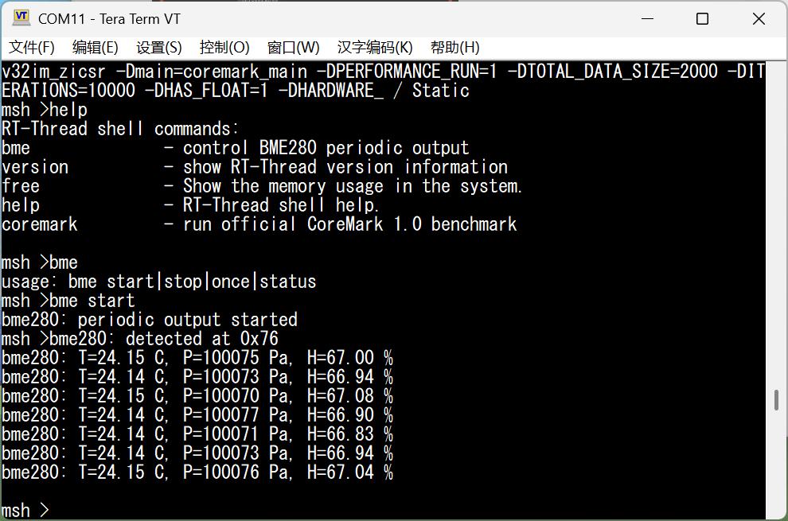
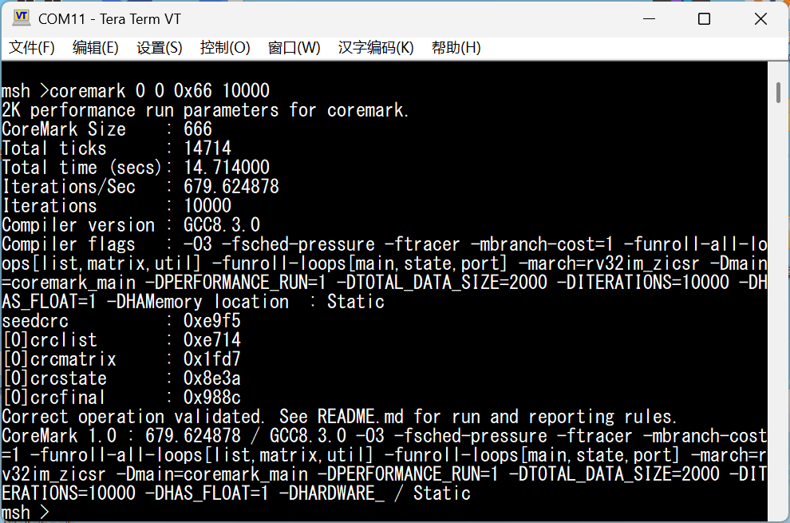

# 重要内容预览

| 核心亮点 | 实现要点 | 结果与价值 |
| --- | --- | --- |
| 双槽顺序流水 | 双槽顺序发射和顺序提交；MEM1/MEM2 后端适配同步 BRAM 返回时序 | 在保持顺序体系结构语义的前提下挖掘相邻指令并行性 |
| 控制流与数据相关优化 | 256 项双发射提示表、64 项 BHT/BTB、多级前递、load-use 冒险控制、64 项 L0 load cache 与 4 项 store bypass | 降低控制重定向和数据相关造成的前端与后端停顿 |
| RV32IM 与运行时支持 | 37 条 RV32I、8 条 RV32M、最小 Zicsr/M-mode trap 子集 | 支持整数程序、RT-Thread 调度和机器模式异常返回 |
| CRC16 硬件加速 | IF 级指令序列握手状态机在预定义序列完成交接后启动 CRC16 加速路径 | 缩短 CoreMark CRC16 热点的字节更新路径；不改变标准 RISC-V ISA 范围 |
| SoC 与系统软件 | 64 KiB IROM、256 KiB BRAM、UART、COUNTER、I2C/BME280 和 RT-Thread Nano | 提供 finsh/msh 命令行、环境采样和 CoreMark 运行环境 |
| 功能与性能验证 | 六组定向测试、45 个开源指令用例、运行时与外设验收及 CoreMark | 定向测试全部通过；CoreMark 在 10,000 次迭代下达到 679.624878 iter/s |

Table: 作品核心亮点预览
{widths=18,47,35}

# 项目概述

## 项目背景

本项目面向竞业达 FPGA 数字孪生平台，设计并实现一套 32 位小端 RISC-V 处理器系统。处理器运行 RV32IM 裸机程序和 RT-Thread Nano 3.1.5。SoC 同时提供 finsh/msh 串口命令行、EEMBC CoreMark 1.0、板级显示接口和 BME280 环境传感器接入。

CPU 核采用双槽顺序发射、顺序提交结构，支持比赛要求的 37 条 RV32I 基础指令、RV32M 全部 8 条指令，以及项目运行时使用的最小 Zicsr/M-mode trap 子集。为适配 FPGA 同步存储器，后端采用 MEM1/MEM2 两级访存流水；前端配有分支预测和双发射提示表，数据侧配有多级前递、load-use 冒险控制与小容量 L0 load cache。CoreMark CRC16 热点采用项目专用硬件加速，IF 级通过指令序列握手状态机在预定义序列完成交接后启动加速路径。该路径不是标准 RISC-V 扩展。

## 系统组成

系统按处理器核、SoC 接口和运行时三层组织。处理器核负责取指、译码、执行、访存和顺序写回；`student_top` 连接双口 IROM、统一数据端口和 `perip_bridge`；RT-Thread BSP 在固定地址空间上实现软件 tick、UART 控制台、CoreMark 命令与 BME280 采样。各层共享同一套地址和时序约定，CPU-only 模型不另设简化接口。

| 层次 | 当前实现 | 正文位置 |
| --- | --- | --- |
| 指令系统 | 37 条 RV32I、8 条 RV32M、六种 Zicsr、`ecall`、`mret` | RISC-V CPU 架构设计 |
| 微架构 | 双槽顺序发射/提交，MEM1/MEM2 后端，多级前递与精确冲刷 | CPU 核心微架构 |
| 性能结构 | 256 项双发射提示表、64 项 BHT/BTB、64 项 L0、4 项完整字 store bypass | CPU 性能优化设计 |
| SoC 与系统软件 | 64 KiB IROM、256 KiB BRAM、UART、COUNTER、MMIO FPU、I2C/BME280、RT-Thread Nano | SoC 层次与接口、系统软件设计 |
| 验证 | 定向回归、开源白名单、运行时外设验收与 CoreMark | 功能验证、性能评估 |

Table: 系统组成与报告索引
{widths=20,50,30}

## 设计目标

1. 实现比赛要求的 37 条 RV32I 基础整数指令，并保持自然对齐的 byte、half 和 word 小端访存语义；
2. 支持 RV32M 全部 8 条乘除法指令，正确处理除零与 `INT_MIN/-1` 有符号溢出；
3. 提供 RT-Thread 所需的最小 Zicsr/M-mode trap 能力，不将其表述为完整特权架构；
4. 在顺序提交约束下，每拍最多发射和提交两条指令；
5. 通过前递、冒险检测、分支预测、L0 load cache 和热点融合减少不必要的停顿；
6. 保持 `mycpu` 固定顶层接口和 SoC 地址语义，使 CPU-only 仿真、Vivado 工程与板级系统使用相同的存储器时序；
7. 在 RT-Thread Nano 上提供可交互的 finsh/msh、官方 CoreMark 入口和可停用的 BME280 周期采样。

## 设计平台

| 项目 | 配置 |
| --- | --- |
| FPGA 平台 | 竞业达 FPGA 数字孪生平台 |
| 目标器件 | Xilinx Kintex-7 XC7K325T-FFG900-2 |
| FPGA 工具 | AMD Vivado 2025.2.1 |
| RTL | SystemVerilog |
| CPU-only 仿真 | Verilator 5.032，采用独立同步 IROM/BRAM、MMIO、UART 和 FPU 模型 |
| 测试 ISA/ABI | `rv32im_zicsr/ilp32`，禁用压缩指令和链接松弛 |
| 板级时钟 | 200 MHz 差分输入，PLL 输出 200 MHz CPU 时钟和 50 MHz 外设时钟 |
| 存储空间 | 64 KiB IROM，256 KiB BRAM |

Table: 设计与验证平台
{widths=20,80}

# RISC-V CPU 架构设计

## RV32I 指令集支持情况 {#sec-rv32i-support}

设计已覆盖比赛基础考核涉及的 37 条 RV32I 指令。`fence` 和 `ebreak` 不属于这 37 条指令，`ecall` 则由机器模式 trap 通路处理。

| 类别 | 指令 | 数量 |
| --- | --- | ---: |
| 高位立即数 | `lui`、`auipc` | 2 |
| 跳转 | `jal`、`jalr` | 2 |
| 条件分支 | `beq`、`bne`、`blt`、`bge`、`bltu`、`bgeu` | 6 |
| Load | `lb`、`lh`、`lw`、`lbu`、`lhu` | 5 |
| Store | `sb`、`sh`、`sw` | 3 |
| 立即数运算 | `addi`、`slti`、`sltiu`、`xori`、`ori`、`andi`、`slli`、`srli`、`srai` | 9 |
| 寄存器运算 | `add`、`sub`、`sll`、`slt`、`sltu`、`xor`、`srl`、`sra`、`or`、`and` | 10 |
| 合计 |  | **37** |

Table: RV32I 基础指令支持范围
{widths=20,70,6}

算术结果按 32 位回绕，移位量取低 5 位；`x0` 恒为零，`jalr` 目标地址的最低位清零。设计只保证自然对齐访存，暂不处理非法指令、未对齐访问和总线访问故障异常。

## SoC 层次与接口 {#sec-soc-interface}

系统以 `student_top` 为处理器子系统边界，由 CPU 核 `Core_cpu`、共享双口 IROM 和外设桥 `perip_bridge` 组成。两路 IROM 端口分别读取当前 PC 和 `PC+4` 对应的 32 位指令。`student_top` 使用 14 位字地址访问 `16384 × 32 bit` IROM，物理容量为 64 KiB。PC 高位不参与片内 ROM 寻址，因此软件必须把可执行代码限制在 `0x8000_0000`--`0x8000_FFFF`。

{ width=100% }

CPU 数据侧只有一组统一接口。`perip_bridge` 将请求译码到同步 BRAM 或 MMIO：BRAM load 延迟一拍返回，MMIO 走独立组合/寄存路径。当前地址映射如下。

| 访问目标 | 地址范围或地址 | 接口属性 |
| --- | --- | --- |
| BRAM | `0x8010_0000`--`0x8013_FFFF` | 256 KiB，支持自然对齐 byte、half、word 访问 |
| SW0 / SW1 | `0x8020_0000` / `0x8020_0004` | 64 位虚拟开关的低/高 32 位，只读 |
| KEY | `0x8020_0010` | 8 位虚拟按键，只读 |
| SEG | `0x8020_0020` | 40 位数码管输出，写数据可回读 |
| LED | `0x8020_0040` | 32 位 LED 输出 |
| COUNTER | `0x8020_0050` | 50 MHz 计时器，特定写值控制启动和停止 |
| UART DATA / STATUS | `0x8020_0060` / `0x8020_0064` | UART 数据、忙/有效/透传状态 |
| CoreMark FPU | `0x8020_0070`--`0x8020_0080` | 计时结果换算用有限 binary32 MMIO 单元，不属于 RV32F |
| I2C/BME280 | `0x8020_0084`--`0x8020_0090` | 从机地址、寄存器地址、数据和控制/状态寄存器 |

Table: CPU 子系统地址映射
{widths=20,20,60}

COUNTER 写入 `0x8000_0000` 后开始计时，写入 `0xFFFF_FFFF` 后停止。I2C 主机工作在 200 MHz CPU 域，产生 100 kHz 开漏 SCL/SDA，并通过 J7 连接 BME280。UART 在 200 MHz CPU 域和 50 MHz 外设域之间完成握手。CPU 总线没有 ready/valid、重试或错误响应，任何接口修改都必须保持现有返回拍数。

## CPU 核心微架构

CPU 采用双槽顺序发射、顺序提交结构。源码仍按 IF、ID、EX、MEM 和 WB 五类功能模块组织，但为适配同步 BRAM，访存后端被拆分为 MEM1 和 MEM2，因此实际流水边界为 `IF/ID -> ID/EX -> EX/MEM1 -> MEM1/MEM2 -> MEM2/WB`。图中的上、下两条主数据通路分别对应槽 0 和槽 1：槽 0 保存包内较老指令，槽 1 保存较年轻指令。

{ width=100% }

蓝色主通路表示取指、级间数据传递和寄存器写回，橙色通路表示共享 LSU、数据总线与 L0 cache 的访存路径，紫色通路表示 MEM1/MEM2 前递和 WB 同拍读旁路，红色通路表示 stall、flush、busy 和重定向等控制反馈。数据与控制信号随 valid 经过级间寄存器。复位、冲刷或气泡会清除有效性，并屏蔽错误路径上的体系结构副作用。

### 双路取指与分支预测（IF）

PC 是复位值为 `0x8000_0000` 的 32 位寄存器。IF 并行形成 `PC+4`、`PC+8` 和预测目标，并在 EX 重定向、预测跳转与顺序地址之间选择下一 PC。双发射时顺序前进 8 字节，单发射时前进 4 字节。

双发射提示表共有 256 项，索引为 `pc[9:2]`，tag 覆盖 `pc[15:8]`。同步 IROM 返回候选包后，前端按指令类别、包内 RAW、双访存和双 RV32M 冲突训练表项。冷启动和 tag 未命中均保守单发射。分支预测器包含 64 项 BHT 和 64 项 BTB，索引为 `pc[7:2]`，BTB tag 同样覆盖 `pc[15:8]`。BTB 未命中时预测不跳转。命中后，`jal` 直接预测跳转，条件分支由 2 位饱和计数器决定方向。`jalr`、`ecall` 和 `mret` 在 EX 解析。

### 译码、寄存器读取与发射控制（ID）

两个 ID 槽分别完成主控制译码、ALU/CSR 控制译码、立即数生成和寄存器索引提取。共享寄存器组包含 32 个 32 位通用寄存器，提供 4 个读端口和 2 个写端口，可同时为两个槽读取各自的 `rs1`、`rs2`，并在同一拍接收两路写回。对 `x0` 的写入被屏蔽，读取 `x0` 始终得到 0。WB 到 ID 的同周期旁路用于消除寄存器组读写同拍造成的数据陈旧。

槽 1 只有在包内不存在从槽 0 到槽 1 的 RAW 相关且资源允许时才有效。WAW 不阻止配对。若两槽同拍写同一非零 `rd`，槽 1 的较新值最终可见。控制流、CSR/SYSTEM、双访存和双 RV32M 组合均退化为单发射。该约束避免引入乱序调度和重排序缓冲区，同时保持槽 0 先于槽 1 的程序顺序。

### 整数执行、多周期运算与重定向（EX）

两个 EX 槽均包含 RV32I ALU 和 RV32M 运算通路。ALU 使用 24 位独热控制码：低 14 位选择 RV32I 算术、逻辑、移位和比较，`[21:14]` 选择 RV32M，bit 22 当前未用，bit 23 选择项目专用 CRC16 硬件加速运算。Load/store 地址由独立的 `rs1+imm` 加法通路形成，分支比较也单独产生结果。

RV32M 单元启动时锁存操作数与类型。RV32M 单元中的普通 `mul` 等待一个周期，高位乘法等待两个周期，普通除法和余数进行 32 次迭代。EX 级另对操作数可证明处于 18 位有符号范围的普通 `mul` 使用窄值域快速路径，不启动多周期单元。任一实际进入多周期单元的槽 busy 时，前端与 ID/EX 保持，避免尚未完成的指令被覆盖。完成结果与普通 ALU 结果一样进入后端，可被后续指令前递。

槽 0 还包含 CSR 文件与统一重定向逻辑。CSR 文件实现 `mstatus`、`mtvec`、`mscratch`、`mepc` 和 `mcause`。`ecall` 保存异常 PC 并写入 `mcause=11` 后跳转到 `mtvec`，`mret` 恢复相关状态并跳转到 `mepc`。EX 将分支实际方向和目标与预测元数据比较，只有不一致时才把正确 PC 反馈到 IF，并冲刷 IF/ID 与 ID/EX。

### 共享访存端口与 L0 cache（MEM1/MEM2）

CPU 数据侧只有一个端口，因此同一发射包最多包含一条 load/store。MEM1 从两个槽中选择有效访存请求，通过共享 LSU 输出地址、写数据和访问宽度。LSU 按小端字节序生成 `sb`、`sh`、`sw` 所需的写数据与 byte mask。MEM2 将同步 BRAM 返回的完整 32 位原始字与相应流水元数据对齐，byte/half lane 选择及符号或零扩展留到写回路径完成。

64 项直接映射 L0 load cache 只保存 BRAM 的完整 32 位数据字，不缓存 MMIO。Load 在 EX 提前探测缓存。命中时，数据可在下一拍由 MEM1 送入前递网络。未命中时，冒险控制等待 BRAM 数据沿 MEM2 后端返回。Store 对 BRAM 写穿，并使同一字地址的 L0 行失效。另有 4 项完整字 store bypass 保存近期 `sw` 数据；byte/half store 会失效对应项，避免后续 load 读到不完整的整字。

### 冒险控制与前递网络

冒险单元同时检查两个消费者槽对 ID/EX 和 EX/MEM1 中两槽 load 的依赖，并结合 L0 与 store bypass 的数据就绪状态产生 stall、bubble 与 flush。普通 ALU 相关由 EX 前递解决：候选值来自 MEM1、MEM2 和消费者本地 late 数据，同一阶段内槽 1 的较新结果优先。WB 同拍相关不再进入 EX 多路器，而由寄存器组的 WB-to-ID 读旁路处理。

控制流误预测的重定向优先于普通前端推进，并使错误路径指令失效；RV32M busy 则保持前端和 ID/EX。valid、stall、flush 与 busy 共同构成统一的流水控制，使停顿时不丢失在途指令、冲刷时不保留错误副作用。

### 写回选择与顺序提交（WB）

两个 WB 槽分别通过写回多路器选择 `PC+4`、ALU/RV32M 结果、load 扩展结果、U 型立即数或 CSR 旧值，再写入寄存器组的两个写端口。若两槽同拍有效，槽 0 先于槽 1 按程序顺序提交。图中的 In-order Commit 表示写回顺序约束，并不额外增加流水级。

## 主要数据通路选择

| 指令类型 | ALU 输入 A | ALU 输入 B | 运算或地址路径 | 下一 PC | 写回数据 |
| --- | --- | --- | --- | --- | --- |
| R 型 | `rs1` | `rs2` | ALU | `pc+4/pc+8` | ALU 结果 |
| I 型算术 | `rs1` | I 型立即数 | ALU | `pc+4/pc+8` | ALU 结果 |
| Load | `rs1` | I 型立即数 | LSU 地址加法器 | `pc+4/pc+8` | Load 扩展结果 |
| Store | `rs1` | S 型立即数 | LSU 地址加法器 | `pc+4/pc+8` | 无 |
| Branch | `rs1` | `rs2` | 分支比较器 | 预测地址或 EX 重定向 | 无 |
| `jal` | PC | J 型立即数 | 跳转目标加法 | 预测目标 | `pc+4` |
| `jalr` | `rs1` | I 型立即数 | ALU 加法并清除 bit 0 | EX 重定向 | `pc+4` |
| `lui` | 0 | U 型立即数 | 立即数直通 | `pc+4/pc+8` | U 型立即数 |
| `auipc` | PC | U 型立即数 | ALU 加法 | `pc+4/pc+8` | ALU 结果 |

Table: RV32I 各类指令的数据通路选择

写回多路器根据 `MemToReg` 选择数据：`000` 对应 `pc+4`，`001` 对应 ALU/RV32M 结果，`010` 对应 load 数据，`011` 对应 U 型立即数，`100` 对应 CSR 旧值。两个槽共用这套编码。

## 控制器与流水控制

### 控制信号表

| 指令类型 | `NpcOp` | `RegWrite` | `MemToReg` | `MemRead` | `MemWrite` | `ALUSrcA` | `ALUSrcB` |
| --- | --- | ---: | --- | ---: | ---: | ---: | ---: |
| R 型/RV32M | `00` | 1 | `001` | 0 | 0 | 0 | 0 |
| I 型算术 | `00` | 1 | `001` | 0 | 0 | 0 | 1 |
| Load | `00` | 1 | `010` | 1 | 0 | 0 | 1 |
| Store | `00` | 0 | `000` | 0 | 1 | 0 | 1 |
| Branch | `01` | 0 | `000` | 0 | 0 | 0 | 0 |
| `jal` | `11` | 1 | `000` | 0 | 0 | 0 | 1 |
| `jalr` | `10` | 1 | `000` | 0 | 0 | 0 | 1 |
| `lui` | `00` | 1 | `011` | 0 | 0 | 0 | 1 |
| `auipc` | `00` | 1 | `001` | 0 | 0 | 1 | 1 |
| Zicsr | `00` | 1 | `100` | 0 | 0 | 0 | 1 |
| `ecall/mret` | `10` | 0 | `000` | 0 | 0 | 0 | 1 |

Table: 各类指令的主要控制信号

`NpcOp=00/01/10/11` 依次表示顺序执行、条件分支、绝对目标类重定向和 `jal`。`OffsetOrigin` 区分普通立即数、`jalr` 的 ALU 结果与 CSR trap 目标。控制信号和 valid 随级间寄存器向后传递，不跨级直接驱动后端副作用。

### 分层译码与控制传递

控制器采用分层译码。`main_ctrl` 生成寄存器写、访存、写回和下一 PC 控制；`imm_gen` 生成 I/S/B/U/J 五类立即数；`alu_ctrl` 根据 `opcode`、`funct3` 和 `funct7` 产生 24 位独热运算码，其中 bit `[13:0]` 用于 RV32I/分支运算，`[21:14]` 用于 RV32M，bit 22 未用，bit 23 用于项目专用 CRC16 硬件加速运算；`csr_ctrl_decode` 识别六种 Zicsr 指令以及 `ecall`、`mret`。`mycpu_decoder` 把这些子模块封装成单槽译码器，两个 ID 槽各实例化一套。

双发射判定会检查 slot0 到 slot1 的 RAW 依赖，以及双访存和双 RV32M 冲突；WAW 不会阻止双发射，同一拍写入同一 `rd` 时，第二槽结果覆盖第一槽。控制流、CSR、双访存及双 RV32M 组合均按单发射执行。EX 级把实际分支结果与预测元数据进行比较。方向或目标不一致时重定向 PC，并冲刷 IF/ID 和 ID/EX，预测正确时则让流水线继续执行。

执行 `ecall` 时，处理器保存异常 PC，写入 `mcause=11`，随后跳转到 `mtvec`；执行 `mret` 时，处理器恢复 `mstatus.MIE/MPIE` 并跳转到 `mepc`。目前尚未实现非法指令、未对齐访问、中断、U/S 模式和完整的 CSR 权限检查。
译码结果不会跨级直接驱动后端副作用，而是与 PC、寄存器索引、预测元数据和 valid 一起逐级寄存。ID 发射控制先关闭不满足配对条件的槽 1；冒险控制再根据在途指令决定保持或插入气泡；EX 重定向则使错误路径失效。当前异常体系只覆盖项目测试所需的机器模式最小子集，尚未实现非法指令、未对齐访问、总线故障、中断、U/S 模式和完整 CSR 权限检查。

# CPU 性能优化设计

## 双槽顺序发射与后端流水化 {#sec-dual-issue-memory}

双槽结构在不改变顺序语义的前提下利用相邻指令间的并行性。IF 级根据候选指令的类别、slot0→slot1 RAW、双访存和双 RV32M 冲突判断双发射合法性，并将结果训练到提示表。命中后，ID 级完成译码、寄存器读取、前递选择和在途冒险控制。无法配对时，槽 1 失效，槽 0 按单发射继续执行。不需要编译器插入专用打包指令。

{ width=88% }

同步 BRAM 的请求和返回跨越一个 CPU 时钟周期及流水级边界，后端因此分为 MEM1 与 MEM2。CPU、IROM、BRAM、MEM1 和 MEM2 均处于 CPU 时钟域，并非跨时钟域传输。MEM1 选择共享数据端口并形成请求，MEM2 对齐返回数据和控制元数据，WB 再完成 byte/half lane 选择与符号扩展。前递和 load-use 判断均以数据的真实可用拍为准，而不是沿用单周期组合存储器假设。

## 控制流与数据局部性

64 项 BHT/BTB 降低重复分支的重定向代价。BTB 未命中时保守预测不跳转；命中后，条件分支读取 2 位计数器，`jal` 直接使用缓存目标。EX 只在方向或目标不一致时发起重定向。预测器不会改变架构结果，错误预测仅损失若干流水周期。

64 项 L0 load cache 保存 BRAM 完整字，并在 EX 提前探测。命中数据可在 MEM1 前递；store 写穿 BRAM 并失效同字地址缓存行。4 项完整字 store bypass 解决短距离 store-to-load 可见性，byte/half store 则失效对应 bypass 项，避免用不完整数据覆盖整字。

## 关键路径控制

工程目标频率为 200 MHz。为缩短 PC 反馈、前递选择和访存返回路径，IF 并行形成固定步长地址，双发射合法性经提示表反馈；ID 预先编码前递选择，EX 主要保留数据多路选择；load/store 使用独立地址加法器；重定向目标和有效位打拍后再驱动 flush。

# RTL 关键模块设计

## 流水级模块
### `mycpu_if_stage`
功能：IF 级维护 PC，在顺序地址、BTB 预测目标和 EX 重定向目标之间选择下一 PC。内部 256 项双发射提示表把候选包判断移出 PC 反馈关键路径。同步 IROM 停顿期间由 hold 寄存器保存当前返回包，地址口可以继续形成预取请求。

接口：

| 端口名                              | 类型   | 描述                     |
| ----------------------------------- | ------ | ------------------------ |
| `irom_data`, `irom_data1`           | input  | 两路同步 IROM 返回指令   |
| `IF_npc_redirect`                   | input  | 32 位 EX 重定向目标      |
| `clk`, `rst`                        | input  | 时钟与高有效复位         |
| `Stall`, `BranchRedirect`            | input  | 前端冻结与重定向有效     |
| `BP_update_en`, `BP_update_taken`   | input  | 预测更新使能与实际方向   |
| `BP_update_pc`                      | input  | 已解析分支 PC            |
| `BP_update_target`, `BP_update_is_jal` | input | BTB 目标与 JAL 标志   |
| `irom_addr`, `irom_addr1`           | output | 两路 32 位取指地址       |
| `IF_pc`                             | output | 32 位当前 PC             |
| `IF_instr`, `IF_instr1`             | output | 取指包中的两条指令       |
| `IF_issue_dual`                     | output | 双发射提示               |
| `IF_pred_taken`, `IF_pred_target`   | output | 预测方向与 32 位目标     |

Table: mycpu_if_stage 接口描述

### mycpu_id_stage
功能：ID 级单槽译码外壳，内部通过统一译码器完成寄存器字段提取、主控制译码、立即数生成、24 位 ALU 独热译码以及 CSR/SYSTEM 指令译码。核心对两个指令槽各实例化一份，并在顶层完成包内相关和资源冲突检查。

接口描述：

| 端口名                    | 类型   | 描述                |
| ------------------------- | ------ | ------------------- |
| ID_instr                  | input  | 32 位 ID 指令       |
| ID_imm                    | output | 32 位扩展立即数     |
| ID_RegWrite               | output | 寄存器写使能        |
| ID_MemWrite, ID_MemRead   | output | store/load 控制     |
| ID_ALUSrcA, ID_ALUSrcB    | output | ALU 输入来源        |
| ID_MemToReg               | output | 3 位写回来源        |
| ID_NpcOp, ID_OffsetOrigin | output | 两组 2 位控制流控制  |
| ID_ALUControl             | output | 24 位运算独热码     |
| ID_csr_idx, ID_csr_zimm   | output | CSR 地址与立即数    |
| ID_CSRControll            | output | 6 位 CSR/SYSTEM 控制 |
| ID_rs1, ID_rs2, ID_rd     | output | 三组 5 位寄存器索引  |

Table: mycpu_id_stage 接口描述

### mycpu_ex_stage
功能：EX 级使用已选前递数据完成 RV32I 运算、load/store 地址生成、RV32M 多周期执行、CSR 读改写和控制流解析。RV32M 执行期间通过 `EX_busy` 保持前端与 ID/EX，`EX_kill` 用于禁止错误路径启动多周期运算、写 CSR或产生重定向。

关键接口信号：

| 端口名 | 类型 | 描述 |
| --- | --- | --- |
| `MEM_forward_data`, `MEM_S1_forward_data` | input | MEM1 两槽前递数据 |
| `MEM2_forward_data`, `MEM2_S1_forward_data` | input | MEM2 两槽前递数据 |
| `WB_wdata`, `WB_S1_wdata` | input | 两个 WB 写回数据 |
| `EX_pc`, `EX_imm` | input | 当前指令 PC 与立即数 |
| `EX_rR1_data`, `EX_rR2_data` | input | ID/EX 原始操作数 |
| `EX_ALUControl` | input | 24 位独热运算控制 |
| `EX_NpcOp`, `EX_OffsetOrigin` | input | 控制流与目标来源控制 |
| `EX_csr_idx`, `EX_csr_zimm`, `EX_CSRControll` | input | CSR 地址、立即数与控制 |
| `ForwardA`, `ForwardB` | input | 前递选择码 |
| `ForwardAData`, `ForwardBData` | input | 顶层已解析的前递操作数 |
| `EX_mul_narrow_a`, `EX_mul_narrow_b` | input | 窄值域乘法有效标签 |
| `EX_ALUSrcA`, `EX_ALUSrcB` | input | ALU 输入来源选择 |
| `EX_pred_taken`, `EX_pred_target` | input | 分支预测元数据 |
| `EX_stall`, `EX_kill` | input | 停顿保持与错误路径失效 |
| `clk`, `rst` | input | CPU 时钟与高有效复位 |
| `IF_npc_redirect_raw` | output | 组合重定向目标 |
| `EX_alu_result`, `EX_mem_addr` | output | ALU/RV32M 结果与访存地址 |
| `EX_forward_B_out` | output | 前递后的第二操作数 |
| `EX_csr_wb` | output | CSR 旧值 |
| `BranchTaken`, `BranchMispredict`, `EX_busy` | output | 控制流结果与多周期忙标志 |

Table: mycpu_ex_stage 关键接口信号

## 执行与多周期运算

### alu
功能：EX 级 32 位算术逻辑单元。`ALUControl[13:0]` 选择加减、逻辑、移位和比较。`ALUControl[23]` 选择项目专用 CRC16 硬件加速结果。加法、减法及比较共享加减法器，分支判断通过 `isTrue` 独立输出，避免控制流路径再次汇总完整结果。

接口：

| 端口名     | 类型   | 描述                            |
| ---------- | ------ | ------------------------------- |
| A, B       | input  | 两个 32 位操作数                |
| ALUControl | input  | 24 位独热码                     |
| Result     | output | 32 位运算结果                   |
| isTrue     | output | 分支条件布尔结果                |

Table: alu 接口描述

### rv32m_unit
功能：实现 `mul`、`mulh`、`mulhsu`、`mulhu`、`div`、`divu`、`rem` 和 `remu`。RV32M 单元中的普通乘法等待 1 个周期，高位乘法等待 2 个周期，正常除法和余数运算执行 32 次迭代。EX 级的窄值域普通 `mul` 快速路径绕过本单元。除零及有符号除法溢出使用快速特殊结果路径。

接口：

| 端口名               | 类型   | 描述                     |
| -------------------- | ------ | ------------------------ |
| clk, rst             | input  | 时钟与高有效同步复位     |
| start                | input  | 运算启动脉冲             |
| alu_control          | input  | 24 位独热码，使用 `[21:14]` |
| operand_a, operand_b | input  | 两个 32 位操作数         |
| busy                 | output | 正在执行标志             |
| done                 | output | 结果完成脉冲             |
| result               | output | 32 位结果                |

Table: rv32m_unit 接口描述

### CRC16 硬件加速

`mycpu_if_stage` 通过指令序列握手状态机完成 CRC16 热点序列的交接：当预定义的指令序列按序到达时，状态机将字节更新循环转换为保留 R 型编码的项目专用 CRC16 加速操作，并将紧邻的冗余栈读改写为寄存器 move。加速单元对 `A[15:0] ^ B[15:0]` 执行 8 次右移与 `16'ha001` 异或，结果零扩展为 32 位。该路径不是标准 RV32I/RV32M 或 Zb 指令，只服务该软件热点。

## 冒险、前递与存储优化

### forwarding_unit
功能：EX 级的 MEM1 前递数据多路器。ID 阶段预先计算 `ForwardA_sel`/`ForwardB_sel` 并随消费者寄存。本模块仅在 ID/EX 原始操作数和 MEM1 两槽数据之间选择。MEM2、late load 和 WB 路径在 `mycpu` 顶层及 ID/EX 数据准备逻辑中解析，不是本模块端口。

接口：

| 端口名 | 类型 | 描述 |
| --- | --- | --- |
| `ID_EX_data1`, `ID_EX_data2` | input | 两个 ID/EX 原始操作数 |
| `EX_MEM_data0`, `EX_MEM_data1` | input | MEM1 槽 0 / 槽 1 前递数据 |
| `ForwardA_sel`, `ForwardB_sel` | input | 两组 3 位选择码，`2`/`5` 分别选择 MEM1 槽 0 / 槽 1 |
| `ForwardAData`, `ForwardBData` | output | 两个最终操作数 |

Table: forwarding_unit 接口描述

### hazard_unit
功能：同时检查 IF/ID 两个消费者槽对 ID/EX 和 EX/MEM1 两个 load 生产者槽的依赖，并结合 `LoadReady` 判断 L0 命中数据能否及时前递。数据未就绪时冻结前端并向 ID/EX 注入气泡；误预测时冲刷 IF/ID 与 ID/EX。MEM2 的 late subword miss 由顶层 `Stall_LateSubword` 追加处理。

接口：

| 端口名                               | 类型   | 描述                       |
| ------------------------------------ | ------ | -------------------------- |
| IF_ID_rs1/rs2, IF_ID_rs1_1/rs2_1     | input  | 两槽源寄存器索引           |
| IF_ID_uses_rs1/rs2(_1)               | input  | 两槽源字段有效性           |
| IF_ID_valid_1                        | input  | 槽 1 有效                  |
| ID_EX_rd/rd_1, EX_MEM_rd/rd_1        | input  | 两级两槽 load 目的寄存器   |
| ID_EX_MemRead/MemRead_1              | input  | ID/EX load 标志            |
| ID_EX_LoadReady/LoadReady_1          | input  | ID/EX 数据可前递            |
| EX_MEM_MemRead/MemRead_1             | input  | MEM1 load 标志              |
| EX_MEM_LoadReady/LoadReady_1         | input  | MEM1 数据已就绪             |
| BranchMispredict                     | input  | 误预测状态                 |
| Stall, Flush_IF_ID, Flush_ID_EX      | output | 停顿与两级冲刷             |
| LoadUseEX, LoadUseMEM                | output | 两类 load-use 统计         |

Table: hazard_unit 接口描述

### load_l0_cache {#sec-load-l0-cache-module}
功能：64 项直接映射的 BRAM load 结果缓存，保存完整 32 位字。`lookup` 服务 MEM1，`probe0/probe1` 为两个 EX 提前探测端口，BRAM 返回数据通过 fill 端口写入。Store 仍写穿到 BRAM，并使同一字地址的缓存行失效；MMIO 不进入缓存。

接口：

| 端口名                  | 类型   | 描述                    |
| ----------------------- | ------ | ----------------------- |
| clk, rst                | input  | 时钟与高有效复位        |
| lookup_addr             | input  | 32 位 MEM1 查询地址     |
| lookup_hit, lookup_data | output | 命中及 32 位查询数据    |
| probe_addr0/addr1       | input  | 两个 32 位 EX 探测地址  |
| probe_hit0/hit1         | output | 两个命中标志             |
| probe_data0/data1       | output | 两个 32 位探测数据      |
| fill_en                 | input  | 填充使能                |
| fill_addr, fill_data    | input  | 32 位填充地址与数据     |
| store_en, store_addr    | input  | store 失效使能与地址    |

Table: load_l0_cache 接口描述

## SoC 数据访问边界

### perip_bridge {#sec-perip-bridge}
功能：CPU 单一数据端口的地址译码与返回时序模块。它映射 256 KiB BRAM、SW/KEY、SEG、LED、COUNTER、UART、CoreMark FPU 和 I2C/BME280 寄存器。BRAM 按同步读时序返回，MMIO 使用独立数据选择路径。

接口：

| 端口名                         | 类型   | 描述                              |
| ------------------------------ | ------ | --------------------------------- |
| clk, cnt_clk                   | input  | CPU 总线时钟与 50 MHz 外设时钟    |
| rst                            | input  | 高有效复位                        |
| perip_addr, perip_wdata        | input  | 32 位 CPU 地址与写数据            |
| perip_wen, perip_mask           | input  | 写使能与 2 位访问宽度             |
| perip_rdata                    | output | 32 位 BRAM/MMIO 返回              |
| virtual_sw_input               | input  | 64 位虚拟开关                     |
| virtual_key_input              | input  | 8 位虚拟按键                      |
| virtual_seg_output              | output | 40 位数码管状态                   |
| virtual_led_output              | output | 32 位 LED 状态                    |
| UART 数据/状态端口              | mixed  | 连接 `uart_bridge` 的收发与透传信号 |
| BME280 I2C 端口                 | inout  | J7 上的开漏 SCL/SDA              |


Table: perip_bridge 接口描述

`UART_DATA` 和 `UART_STATUS` 的位语义见 SoC 地址表。`fpu_mmio` 只提供 CoreMark 计时换算所需的有限 binary32 操作，不代表处理器实现 RV32F。`i2c_register_master` 每次执行一个寄存器级读写事务。软件负责设置从机地址、寄存器地址和方向，并轮询 BUSY/DONE/NACK。

### fpu_mmio
功能：CoreMark 计时结果换算使用的单精度 MMIO 协处理模块。模块支持无符号 32 位整数到 binary32 的转换，以及有限正规 binary32 除法。运算以多周期状态机执行。它不接入 CPU 的 EX 流水线，不执行 RISC-V 浮点指令，也不构成 RV32F 实现。

软件通过 `FPU_A`、`FPU_B` 写入操作数，再向 `FPU_CMD` 写入命令。`FPU_STATUS[0]` 表示忙状态，`FPU_STATUS[1]` 表示结果完成，`FPU_RESULT` 返回 32 位 binary32 结果。除零、零操作数和非有限/非正规输入均按模块定义的结果路径处理。该模块仅覆盖 CoreMark 计时换算所需的运算范围。

| 端口名 | 类型 | 描述 |
| --- | --- | --- |
| `clk`, `rst` | input | CPU 时钟与高有效复位 |
| `addr`, `wdata`, `wen` | input | MMIO 地址、写数据与写使能 |
| `rdata` | output | MMIO 读数据 |

| 地址 | 寄存器 | 作用 |
| --- | --- | --- |
| `0x8020_0070` | `FPU_A` | 操作数 A |
| `0x8020_0074` | `FPU_B` | 操作数 B |
| `0x8020_0078` | `FPU_CMD` | 命令：`1` 为 u32→binary32，`2` 为 binary32 除法 |
| `0x8020_007C` | `FPU_STATUS` | `busy` 与 `done` 状态 |
| `0x8020_0080` | `FPU_RESULT` | binary32 结果 |

Table: fpu_mmio 接口与寄存器映射

# 处理器特色功能设计

## CRC16 硬件加速

CoreMark 的 CRC16 字节更新使用专用硬件加速路径。IF 级的指令序列握手状态机在预定义序列满足交接条件后发起 CRC16 加速操作，替代软件字节位循环，并将紧邻的冗余栈读改写为寄存器 move。内部 ALU 对 `rs1[15:0] ^ rs2[15:0]` 执行 8 次右移和多项式 `16'hA001` 异或，结果零扩展到 32 位。

加速路径不依赖固定 PC；stall 时握手状态保持，重定向时状态清零。该机制只对预定义指令序列生效，不属于标准 RV32I、RV32M 或 Zb 指令集，也不代表通用 CRC 扩展支持。

## 动态分支预测 {#sec-branch-prediction}

预测器使用 64 项 BHT 和 64 项 BTB。索引取 `pc[7:2]`，BTB tag 取 `pc[15:8]`，覆盖 64 KiB IROM 内索引之外的地址位。首次训练时，条件分支按实际方向初始化为弱跳转或强不跳转状态；后续按 2 位饱和规则更新。BTB 未命中时不预测跳转。

{ width=88% }


## L0 load cache {#sec-l0-cache-design}

L0 是 64 项直接映射完整字缓存，索引为地址 `addr[7:2]`，tag 覆盖 BRAM 剩余字地址位。EX 的两个 probe 端口用于提前判断 load 数据是否可在 MEM1 前递，MEM1 lookup 提供实际数据。BRAM 返回后经 fill 端口写入。MMIO 不进入缓存，store 写穿并使同字地址缓存行失效。

{ width=88% }


## RV32M 多周期运算 {#sec-rv32m-design}

`rv32m_unit` 实现 RV32M 八条指令。RV32M 单元中的普通 `mul` 等待 1 个周期，高位乘法等待 2 个周期，常规除法和余数执行 32 次迭代。EX 级的窄值域普通 `mul` 快速路径绕过该单元。除零与有符号 `INT_MIN/-1` 溢出采用专门结果路径。溢出快速路径只对 `div/rem` 生效，`divu/remu` 仍按无符号语义执行。

## Zicsr 与机器模式异常返回 {#sec-zicsr-trap}

CSR 通路支持 `csrrw/csrrwi`、`csrrs/csrrsi`、`csrrc/csrrci`，CSR 文件实现 `mstatus`、`mtvec`、`mscratch`、`mepc` 和 `mcause`。`ecall` 写入 `mcause=11` 并跳转到 `mtvec`。处理程序可调整 `mepc` 后以 `mret` 返回。实现范围不包括中断、PMP、U/S 模式、非法指令异常和完整 CSR 权限检查。

# 系统软件设计

## RT-Thread Nano 与 finsh/msh {#sec-rtthread-runtime}

`rt-thread/` 集成 RT-Thread Nano 3.1.5、RISC-V common port 和 `bsp/mycpu`。当前 CPU 没有中断通路，BSP 在 idle hook 中轮询 50 MHz COUNTER，并按毫秒调用 `rt_tick_increase`。单次最多补偿 64 ms。上下文切换通过 `csrw mepc` 与 `mret` 完成。`.text` 位于 64 KiB IROM，`.rodata/.data/.bss` 位于 256 KiB BRAM，堆从 `__bss_end` 延伸到栈顶。

UART 控制台使用 9600 8N1。BSP 写 `UART_STATUS` 请求自动透传，finsh/msh 随后通过 `UART_DATA` 收发字符。无输入时 shell 延时 1 ms，让 idle hook 获得运行机会。板卡默认固件不创建仿真完成线程，避免 3 秒后写 LED 干扰 CoreMark 的计时标记。

## BME280 环境传感器

FPGA 内的 `i2c_register_master` 提供 100 kHz 单事务寄存器访问。RT-Thread 驱动依次探测 `0x76` 和 `0x77`，校验芯片 ID `0x60`，读取校准参数，并以 forced mode 获取温度、气压和湿度。补偿算法使用定点整数，其中气压路径需要 RV32IM/ilp32 对应的 64 位 libgcc 辅助例程。

`bme start` 开启每秒一次的周期采样，`bme stop` 停止并唤醒等待线程，`bme once` 在停止状态读取一次，`bme status` 显示运行状态和最近错误。BME 线程默认阻塞。运行 CoreMark 前应执行 `bme stop`，避免周期 I2C 和 UART 输出干扰基准。

## EEMBC CoreMark 1.0 平台适配 {#sec-coremark}

基准算法主体来自 EEMBC CoreMark 1.0。`core_list_join.c`、`core_matrix.c`、`core_state.c` 和 `core_util.c` 保持上游内容；`core_main.c` 与 `coremark.h` 为本平台的单精度计时换算、无 libc 输出和迭代次数处理做了适配，计时区内的 `iterate` 调用及三类工作负载算法未改动。平台层负责计时、参数传递和输出。

# 实验环境与方法

## CPU-only 仿真环境

CPU-only 仿真采用 Verilator 5.032，提供同步双口 IROM、同步 BRAM、MMIO、UART/FPU 模型和独立 50 MHz COUNTER。CPU 时钟配置为 200 MHz，对应周期为 5 ns。

| 项目 | 配置 |
| --- | --- |
| ISA/ABI | `rv32im_zicsr/ilp32`，禁用压缩指令和链接松弛 |
| CPU 时钟 | 200 MHz，5 ns |
| COUNTER | 50 MHz |
| IROM / BRAM | 64 KiB / 256 KiB |
| 处理器复位地址 | `0x8000_0000` |
| RISC-V GNU 工具链 | GCC 16.1.0 |

Table: CPU-only 仿真实验配置

## 验证分层与判定

验证覆盖六组定向测试、37 个 RV32UI 与 8 个 RV32UM 指令测试、RT-Thread 启动、UART/finsh、CoreMark、LED/SEG/COUNTER 和 BME280 采样。功能用例采用自检签名和 LED 完成状态判定，性能统计仅在对应功能用例通过后记录。

## 评价指标

主要指标包括周期数、退休指令数、CPI、IPC、MIPS、双发射包、前端停顿、load-use 停顿、RV32M busy 周期和 L0 命中率。计算式为：

\begin{equation}
  \mathrm{CPI}=\frac{N_{\mathrm{cycle}}}{N_{\mathrm{inst}}},\qquad
  \mathrm{IPC}=\frac{N_{\mathrm{inst}}}{N_{\mathrm{cycle}}}
\end{equation}

\begin{equation}
  \mathrm{MIPS}=\frac{f_{\mathrm{clk}}}{\mathrm{CPI}},\qquad
  f_{\mathrm{clk}}=200\ \mathrm{MHz}
\end{equation}

L0 命中率为命中次数除以 BRAM load 请求数；没有 BRAM load 的用例记为 N/A。CoreMark/MHz 使用正式 CoreMark 得分除以本次实际 CPU 频率。

# 功能验证 {#sec-functional-verification}

## 定向回归

六组定向测试分别覆盖架构语义和微架构边界。`rv32i` 检查 37 条基础指令、`x0`、分支/跳转和自然对齐子字访存；`rv32m` 检查八条乘除法指令及特殊结果；`zicsr_trap` 检查六种 CSR 操作、五个 CSR 和 `ecall/mret`；`pipeline` 覆盖双槽配对、各级前递、load-use、分支恢复、RV32M busy 与 CRC 融合；`memory` 覆盖 BRAM 边界、byte lane、L0、MMIO 和 COUNTER；`perf_micro` 只在功能通过后用于观察吞吐与停顿。

| 测试 | 结果 | 周期 | 退休指令 | CPI | 主要判据 |
| --- | --- | ---: | ---: | ---: | --- |
| `rv32i` | PASS | 287 | 158 | 1.816 | LED 自检与 signature |
| `rv32m` | PASS | 408 | 91 | 4.484 | 八条 RV32M 及边界值 |
| `zicsr_trap` | PASS | 185 | 106 | 1.745 | CSR 状态与 trap 返回 PC |
| `pipeline` | PASS | 414 | 233 | 1.777 | 双槽、前递、冲刷、CRC 融合 |
| `memory` | PASS | 600,177 | 600,105 | 1.000 | BRAM/L0/MMIO/COUNTER |
| `perf_micro` | PASS | 17,055 | 22,273 | 0.766 | 自检先于性能统计 |

Table: 定向回归结果

六组定向测试均通过，覆盖基础整数指令、乘除法、CSR 与异常返回、双槽流水、访存和混合性能负载。

## 开源指令测试


固定开源指令测试覆盖 37 个 RV32UI 和 8 个 RV32UM 用例。每个用例均经过镜像容量、段地址、重定位和 ISA 范围检查。

| 测试集 | 用例数 | 通过数 | 失败数 |
| --- | ---: | ---: | ---: |
| RV32UI | 37 | 37 | 0 |
| RV32UM | 8 | 8 | 0 |

Table: 开源指令测试结果

## 运行时与外设验收

运行时与外设验收覆盖 RT-Thread 启动、UART 自动透传、finsh/msh 命令行、显示与计时接口，以及 BME280 周期采样。

| 验收项 | 结果 | 实际观测 |
| --- | --- | --- |
| RT-Thread 启动与调度 | 通过 | 启动后进入 `msh >` |
| UART 自动透传与 `msh >` | 通过 | 自动透传与命令提示符正常 |
| `help` 与 twin 状态读回 | 通过 | `help` 输出正常，twin 状态读回正常 |
| LED / SEG / COUNTER | 通过 | 显示与计时接口正常 |
| CoreMark LED 计时标记 | 通过 | 计时区间标记正常 |
| BME280 探测 | 通过 | 探测地址为 `0x76` |
| 温度/气压/湿度样本 | 通过 | `24.14`--`24.15` °C、`100070`--`100077` Pa、`66.83`--`67.08` %RH |
| BME280 命令 | 通过 | `start`、`stop`、`once` 和 `status` 正常 |
| 连续运行稳定性 | 正常 | 未见异常 |

Table: 运行时与外设验收结果
{widths=35,8,60}

{ width=95% }

# 性能评估

定向性能统计反映双槽流水、数据相关、RV32M 多周期执行和 L0 load cache 在固定负载下的行为。MIPS 按 200 MHz 时钟换算，仅表示仿真配置下的指令吞吐。

| 测试 | 周期 | 退休指令 | CPI | 双发射包 | 前端停顿 | load-use EX/MEM | EX busy | L0/BRAM load |
| --- | ---: | ---: | ---: | ---: | ---: | ---: | ---: | ---: |
| `rv32i` | 287 | 158 | 1.816 | 2 | 0 | 0/0 | 0 | 6/8 |
| `rv32m` | 408 | 91 | 4.484 | 2 | 254 | 0/0 | 254 | 0/0 |
| `zicsr_trap` | 185 | 106 | 1.745 | 1 | 0 | 0/0 | 0 | 0/0 |
| `pipeline` | 414 | 233 | 1.777 | 35 | 42 | 3/5 | 34 | 0/5 |
| `memory` | 600,177 | 600,105 | 1.000 | 2 | 9 | 2/7 | 0 | 4/11 |
| `perf_micro` | 17,055 | 22,273 | 0.766 | 6,504 | 252 | 1/1 | 250 | 0/2,001 |

Table: 定向性能统计

## CoreMark 正式成绩 {#sec-coremark-performance}

CoreMark 在 finsh/msh 环境中运行，命令为 `coremark 0 0 0x66 10000`。基准使用性能种子 `0,0,0x66`，总数据量为 2000 字节，迭代次数为 10000。

| 字段 | 实测值 |
| --- | --- |
| 编译器与版本 | GCC 8.3.0 |
| 编译参数 | `-O3`、`-fsched-pressure`、`-ftracer`、`-mbranch-cost=1` 及分文件循环展开 |
| CPU 频率 | 200 MHz |
| 迭代次数 | 10,000 |
| 总计时 tick | 14,714 |
| 运行时间 | 14.714 s |
| CoreMark 分数（iter/s） | 679.624878 |
| CoreMark/MHz | 3.398124 |
| 三项 CRC | `e714` / `1fd7` / `8e3a` |
| `Correct operation validated` | PASS |

Table: CoreMark 正式成绩

{ width=95% }

# 结论

本系统实现 RV32IM 指令执行、双槽顺序流水、MEM1/MEM2 同步访存后端、分支预测、多级前递、L0 load cache 和 store bypass。RT-Thread BSP 提供 UART 命令行、CoreMark 和 BME280 采样。CRC16 硬件加速通过指令序列握手状态机启动，仅作用于预定义软件热点，不扩张处理器对标准 ISA 的承诺。

六组定向测试全部通过，RV32UI 和 RV32UM 指令测试分别实现 37/37 与 8/8 通过。系统能够启动 RT-Thread，提供 UART/msh 控制台、显示与计时接口、BME280 周期采样和 CoreMark 运行环境。CoreMark 在 10,000 次迭代下运行 14.714 s，输出 `Correct operation validated`，三项 CRC 为 `e714`、`1fd7` 和 `8e3a`。

# 附录

## 代码清单

| 文件或目录 | 主要用途 |
| --- | --- |
| `rtl/core/mycpu.sv` | CPU 顶层，连接双槽流水线、前递、冒险、CSR、L0 和访存接口 |
| `rtl/pipeline/stage/` | IF、ID、EX、MEM1 和 WB 组合逻辑 |
| `rtl/pipeline/register/` | 五组流水级间寄存器 |
| `rtl/control/` | 主译码、ALU/CSR 控制、立即数和重定向控制 |
| `rtl/datapath/` | ALU、PC、寄存器组和 RV32M 单元 |
| `rtl/hazard/` | 双槽 load-use 冒险检测和多级前递 |
| `rtl/memory/` | LSU、load mask、BRAM 驱动和 L0 load 缓存 |
| `rtl/bus/perip_bridge.sv` | BRAM/MMIO 地址译码和板级访存时序 |
| `rtl/soc/student_top.sv` | CPU、双路 IROM 和外设桥连接 |
| `rtl/peripheral/` | UART、COUNTER、MMIO FPU 和 I2C 主机 |
| `rt-thread/` | RT-Thread Nano、finsh/msh、CoreMark 与 BME280 BSP |
| `sim_cpu_only/` | Verilator CPU-only 仿真环境 |
| `tb/` | Vivado CPU、板级和 UART testbench |
| `verification/` | 可信定向测试、开源白名单和回归工具 |
| `vivado/tests/` | 历史分层汇编测试，不作为当前可信结果来源 |

Table: 关键源码与验证文件
{widths=40,60}

## 工程目录结构

```text
riscv-cpu-remote/
|-- rtl/
|   |-- core/              CPU 核心顶层
|   |-- pipeline/          流水级与级间寄存器
|   |-- control/           指令译码与控制
|   |-- datapath/          ALU、寄存器组和 RV32M
|   |-- hazard/            冒险检测与前递
|   |-- memory/            LSU、BRAM 与 L0 缓存
|   |-- bus/               外设桥和地址译码
|   |-- soc/               SoC 连接层
|   \-- top/               FPGA 板级顶层
|-- sim_cpu_only/          CPU-only 仿真环境
|-- verification/          CPU 测试和回归工具
|-- tb/                    Vivado testbench
|-- vivado/tests/          汇编测试与镜像工具
|-- ip/                    IROM、BRAM 和 PLL 配置
|-- constraints/           板级约束
|-- scripts/               Vivado 自动化脚本
\-- docs/                  技术文档与设计资料
```

## 参考资料

1. RISC-V International. *The RISC-V Instruction Set Manual, Volume I: Unprivileged ISA*.
2. RISC-V International. *The RISC-V Instruction Set Manual, Volume II: Privileged Architecture*.
3. AMD. *Vivado Design Suite User Guide: Synthesis (UG901)*.
4. IEEE. *IEEE Standard for SystemVerilog, IEEE Std 1800-2017*.

## AI 工具声明

本项目在代码检索、结构核对和技术文档校订中使用了生成式 AI 辅助。架构描述以当前源码为依据，实验结论以可复现的原始结果为依据。AI 生成内容不作为测试、综合或板级验收证据。
